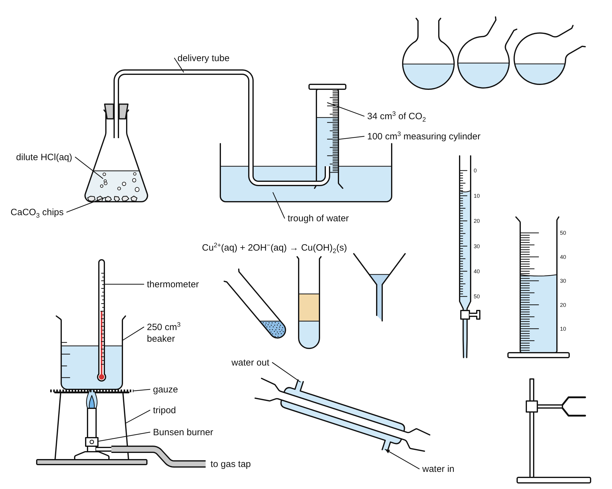

<!-- Snapshot of the live document "PracDraw: build specification", taken on 2 October 2026.
     If this file and the live document differ, the live document wins. -->

# PracDraw: build specification

Oct 2, 2026 · @James Davies

PracDraw is a single-file web tool that draws exam-style diagrams of practical apparatus: a Chemix-like editor built round the AQA required practicals. This document and the starter kit (`pracdraw-starter.zip`) are the complete brief for a build workflow. Phases 0 and 1 are done and tested in the kit, so the workflow starts at phase 2.

## 1. Rules for the build workflow

Follow these ten rules for the whole build.

1. Start from the starter kit. Run `npm ci`. If `/opt/pw-browsers/chromium` does not exist, run `npx playwright install chromium`. Then run `npm run check`. All 320 unit tests and 5 browser tests must pass before you change anything.
2. This document is the authority. `spec/catalogue.json` and `spec/templates.json` in the kit are machine-readable copies of the Symbol catalogue and Templates tabs. If they differ from this document, this document wins: correct the JSON.
3. The decisions in section 3 are final. Open points have defaults in section 16. Use the default and continue.
4. Build in phase order (section 15). A phase is finished only when its gate passes.
5. Look at what you draw. Run `npm run sheet` and open the PNG files. A symbol or template that no agent has looked at is not done.
6. Draw every symbol from the recipes here. Do not copy artwork, code or assets from Chemix or from any other product.
7. Add no run-time dependency. Add a development dependency only when a phase names it.
8. Keep the kit's contracts: file format, `SymbolDef`, render tree, anchor ids. Templates and saved files depend on them. Change one only when a test proves it wrong, and record the change in the final report.
9. The build is unattended. When something cannot be done as written, do the nearest thing that passes the gate and record it. Do not stop to ask.
10. Finish with the report in section 14.

## 2. Product

PracDraw lets a science teacher make a clean, exam-style apparatus diagram in under a minute and paste it into a slide or worksheet. The first users are teachers and technicians. Students are the second group.

It must do five jobs. Each target is an acceptance test in phase 10.

| Job | Target |
| --- | --- |
| Standard set-up: insert a template and copy the picture | 3 clicks, under 15 seconds |
| Own set-up: 6 to 8 parts with labels | under 3 minutes |
| Worksheet version: the same diagram with blank label lines or letters | 1 click |
| Scale-reading question: an exact reading on a cylinder, burette or thermometer | type one number |
| Reuse: open a saved diagram, or an exported SVG, and edit it | 2 clicks |

The reason to build it is the limits of the Chemix free plan. These rows are from the Chemix help pages on 2 October 2026.

| Capability | Chemix free plan | PracDraw |
| --- | --- | --- |
| PNG size | up to 600 × 800 px ([image quality](https://help.chemix.org/article/57-image-quality)) | up to 8192 px a side |
| SVG export | paid plan ([subscriptions](https://help.chemix.org/article/21-subscriptions)) | included |
| Formulae and units in labels | paid plan ([subscriptions](https://help.chemix.org/article/21-subscriptions)) | included |
| Saved diagrams | 3 in the cloud ([subscriptions](https://help.chemix.org/article/21-subscriptions)) | any number of files on the user's own computer |
| Use of the pictures | attribution for public or commercial use ([licence](https://help.chemix.org/article/24-license)) | no conditions |
| All apparatus | some items need the paid plan ([subscriptions](https://help.chemix.org/article/21-subscriptions)) | everything |

PracDraw also adds required-practical templates, worksheet label modes, a photocopy-safe mode and exact scale readings. I did not check whether Chemix has equivalents of those four.

PracDraw keeps three Chemix behaviours that the help pages describe: liquids stay level when a container turns, a container can hold several layers, and parts snap together ([liquids](https://help.chemix.org/article/35-liquid), [distillation set-ups](https://help.chemix.org/article/69-drawing-distillation-setups)).

## 3. Decisions

These ten decisions are final. The starter kit already proves D1 to D7 and D10. Phases 2 and 7 build D8 and D9.

| # | Decision | Choice | Reason |
| --- | --- | --- | --- |
| D1 | Drawing style | 2D section drawings in black line. Glass is one line. Colour only for contents, flames and test colours. | It is what students must draw, and it photocopies. See section 5. |
| D2 | Delivery | One self-contained `index.html`. No server. No network request at run time. | It opens from a file share, a static host or a Claude artifact. |
| D3 | Stack | TypeScript 6, React 19, Vite 8, Zustand 5. Vitest 5, Playwright 1.63, oxlint, Prettier. | These are the versions in the kit's lock file. Do not upgrade during the build. |
| D4 | One render tree | A diagram becomes a tree of three node types: path, text, group. Three back-ends read it: React SVG for the screen, an SVG string for files, Canvas 2D for PNG. | The export cannot differ from the screen. PNG needs no SVG-image loading. Tests run without a browser. |
| D5 | Symbols are code | A symbol is a pure function from size and parameters to geometry. No image files. | Line thickness never scales. Liquids, anchors and scales come from the same geometry. |
| D6 | Plain SVG | Inside the root `svg` element: only `path`, `text`, `tspan` and `g`, and one `metadata` element in an exported file. No clipPath, mask, pattern, filter, gradient, CSS or `use`. | The file must open in office software. Not yet checked in each product: see section 14. |
| D7 | Contents by geometry | The cavity polygon is clipped by the level line in world orientation. | The surface stays level when the item turns. The result is plain paths. |
| D8 | Canvas | Unbounded canvas. Export crops to the content plus 16 u. | No page set-up. |
| D9 | Storage | Files on the user's computer and one autosave slot. No accounts and no cloud. | No set-up, and no pupil or staff data leaves the device. |
| D10 | Units | 1 u = 1 CSS px at 100 % zoom. Main line 2 u. Label text 15 u. | At 0.25 mm per unit the main line prints at 0.5 mm. |

## 4. Scope and releases

Release 1.0 is the editor, 96 symbols and 40 templates. Release 1.1 adds 27 symbols and 3 templates. The lists are in the Symbol catalogue and Templates tabs.

| Release | Contains | Gate |
| --- | --- | --- |
| 1.0 | The editor (sections 9 to 13). All priority A symbols: 96, of which 18 are in the kit. All priority A templates: 40, of which 1 is in the kit. | `npm run check` and `npm run release:a` pass. The phase 10 gate passes. |
| 1.1 | Priority B symbols: 27. Priority B templates: 3. | `npm run release:b` passes. |
| 1.2 | The particle packs of the diagram inventory (`docs/diagram-inventory.md`): atoms and ions, the particle box and the small symbols of phases 14 and 15; the molecule and structure packs follow when James has approved the pilot sheet. Priority C in the catalogue. | `npm run release:c` passes. Every item has a reviewer pass. |
| Later | The 18 items in the "Later" table of the Symbol catalogue tab. | Not part of this build. |

Release 1.0 has a template for 20 of the 21 AQA Combined Science: Trilogy required practicals and for all 12 A-level Chemistry required practicals. The exception is Trilogy practical 6 (reaction time), which has no apparatus set-up to draw. Two Trilogy practicals are covered in part: practical 13 has the distillation but not the pH and dissolved-solids tests, and practical 17 has the irregular solid and the liquid but not the regular solid.

These are out of scope for both releases. Do not build them.

- Accounts, cloud storage, sharing links, live collaboration.
- Animation, pouring liquids.
- 3D views, except the oblique projection of rule S14 in the structure and molecule packs of release 1.2.
- Skeletal formulae, graphs, tables. (Displayed formulae, which draw every atom and every bond, are in scope for the molecule packs of release 1.2.)
- Phone layouts. The minimum window is 900 × 600 px.
- Import of the user's own symbols or pictures.
- A dark canvas. Other languages.

## 5. Drawing style

Every symbol must look as if the same hand drew it. The reference picture below is the standard. `npm run sheet` writes it to `out/reference.png` from `src/demo.ts`, and a copy is in the kit at `docs/style-reference.png`.



| Rule | Text |
| --- | --- |
| S1 | Section view. Glass is one line. Vessels are open at the top. No wall thickness, no shading, no perspective. The one exception is rule S14: a structure that is three-dimensional by nature is drawn in the oblique projection. |
| S2 | Three line weights: main 2 u (outlines, wires), heavy 3 u (tripod top, clamp jaws), detail 1.25 u (graduations, small parts, leaders, liquid surfaces). Colour #111111. Round caps and joins. |
| S3 | Line thickness never scales. A resized symbol is redrawn at the new size. |
| S4 | Glass corners are rounded, radius 3 to 16 u. Three things stay sharp: rims, cut stem ends, and the join of a straight taper (a funnel cone to its stem, a burette to its jet). |
| S5 | Rims turn out 2.5 to 5 u on test tubes, flasks and beakers. |
| S6 | Apparatus is black line on white. Rubber is grey #c9c9c9. Carbon and masses are dark grey #4a4a4a. Only contents, flames and test colours (indicator paper, chromatography spots, spotting-tile wells) have colour. In the particle packs, particles and regions that a key tells apart have a light-grey tint #e4e4e4 (role `tint`); photocopy-safe mode draws them white with hatch lines (role `hatch`) instead. A solid dot is role `ink`. |
| S7 | A liquid is one flat pale tint with a 1.25 u surface line. No gradients and no highlights. |
| S8 | A symmetric object is exactly symmetric about x = 0. |
| S9 | Parts fit at default size. Shared sizes: neck and mouth 34 u, glass tube 7 u, bung hole 9 u. A ground-glass socket is 34 u wide at its mouth. A cone is 34 u wide at its shoulder and narrows to 28 u over 24 u. |
| S10 | Draw the parts a student would label, and nothing more. |
| S11 | Text inside a symbol is only scale numbers, meter letters, readings, terminal signs and short fixed words (the heat arrow, a meter title). Arial, 8 to 14 u. The particle, molecule and structure packs may also put element symbols, charges and numbers inside a symbol, Arial 12 to 18 u, with indices in the label markup (`Na^+`, `Cl^-`, `O_2`). |
| S12 | Photocopy-safe mode must stay readable. No meaning may depend on colour alone. |
| S13 | Joined glassware that is heated (reflux, distillation) is open to the air at exactly one point. Every joint is drawn sealed, with no gap. |
| S14 | A structure that is three-dimensional by nature (a crystal lattice, a cage, a ball-and-stick model) is drawn in one oblique projection (cabinet): the front face is true shape; the depth axis runs up and to the right at 45° and is drawn at half its true length; lines that are hidden are dashed (role `dashed`); atoms and ions are plain circles with no shading (S1), told apart by size and by tint or hatch (S6). No perspective. |

A reviewer checks each symbol against this list on the four contact sheets: plain, filled, photocopy-safe and turned, and anchors. The reviewer is never the author.

1. It is recognisable without its name.
2. It sits inside its red dashed box and on the centre line. Only the small parts that rule 4 in section 8 allows stick out.
3. It is symmetric where it should be. It has no kinks, gaps or stray lines. Arcs join smoothly.
4. The line weights follow S2, and it matches the pilots.
5. Filled sheet: the liquid meets the walls with no gap and no spill.
6. Turned sheet: the surface is level, the dashes stay inside the cavity, and no text is mirrored. This sheet is also flipped, with scale numbers on.
7. It fits its partners at default size.
8. Anchors sheet: each anchor is where its catalogue row and the anchor table in section 8 put it, and its direction line points outwards.
9. The science is right: a scale has real divisions, a flame has the right colour, and nothing is drawn that could not happen.

## 6. Architecture

One pure pipeline turns a document into a render tree, and three back-ends draw that tree. The pipeline (`src/kernel`, `src/symbols`, `src/model`, `src/templates` and `src/render/render.ts`) works without a browser, so it is unit-tested in Node. Only two back-ends need a browser: `NodeView` and the canvas (`toCanvas`, `src/export/canvas.ts`). Browser tests cover them.

*(Drawing in the live document: render pipeline · 3 inputs, 1 tree, 3 outputs.)*

The three boxes on the left and the render tree are pure code with no DOM. The three outputs on the right only draw the tree, so they cannot disagree.

| Folder | Holds | May import from |
| --- | --- | --- |
| `src/kernel` | Path builder, flattening, clipping, contents, tubes, text markup, render tree. No DOM, except the canvas back-end `toCanvas`. | nothing |
| `src/symbols` | `SymbolDef` contract, shared sizes, the pilots, one file for each pack, registry, scale and label helpers. | kernel |
| `src/model` | Document types, transforms, `DocBuilder`. To add: commands, parsing, migrations, snapping, bounds, auto-label. | kernel, symbols |
| `src/render` | Document to render tree. `NodeView` (React). | kernel, symbols, model |
| `src/templates` | `TemplateDef`, one file for each group, index. | kernel, symbols, model |
| `src/export` | Canvas PNG. To add: SVG file, answer key, reopen from SVG. | kernel, model, render |
| `src/host` (new) | Host adapters: files, clipboard, autosave. | nothing |
| `src/editor` (new) | Store, history, tools, pointer state machine. | all of the above |
| `src/ui` (new) | Toolbar, panels, dialogs. | all of the above |
| `scripts`, `e2e`, `spec` | Contact sheets and progress. Browser tests. The plan as JSON. | — |

Phase 2 adds `src/layers.test.ts`. It reads the imports of every file in `src` and fails when one breaks this table.

The render tree has three node types. It is defined in `src/kernel/nodes.ts`.

```ts
type Mat = readonly [number, number, number, number, number, number] // as SVG matrix()
interface PathNode { t: 'path'; d: string; fill?: string; stroke?: string; sw?: number; dash?: readonly number[]; cap?: 'butt' | 'round'; join?: 'round' | 'miter' }
interface TextNode { t: 'text'; x: number; y: number; runs: Run[]; size: number; anchor: 'start' | 'middle' | 'end'; fill: string }
interface GroupNode { t: 'g'; m?: Mat; kids: Node[]; key?: string }
```

The editor draws its own overlay (selection box, handles, guides) in a separate SVG layer above the diagram. The overlay is never part of the render tree, so it can never reach an export.

State lives in one Zustand store in `src/editor/store.ts`.

| Part of the state | Content | In undo history |
| --- | --- | --- |
| `doc` | The document (section 7). It is immutable: every change makes a new object and shares the rest. | yes |
| `past`, `future` | Earlier and undone documents. Limit 200. | — |
| `selection` | Item ids. | no |
| `tool`, `view` | The active tool. Pan and zoom. | no |
| `prefs` | View preferences: snap on or off, dot grid on or off, the recent list. They are not part of the document. | no |
| `gesture` | The drag in progress. It changes `doc` without history until the pointer is released. | one entry on release |

Every change to the document goes through a pure function in `src/model/commands.ts`: `(doc, arguments) => doc`. Event handlers only call commands. Commands are unit-tested without React.

Budgets, checked in phase 10:

| Budget | Limit |
| --- | --- |
| `dist/index.html` | 900 kB (the kit is 260 kB) |
| Network requests at run time | 0 |
| Drag one symbol 300 px in 60 pointer moves, in a diagram of 150 symbols with contents | mean time between animation frames under 20 ms in the Playwright Chromium |
| Open to first paint from `file://` | under 1 s |

To meet the drag budget, `NodeView` must not rebuild every item on every change. Memoise each item's node on the item object and the settings. A label also depends on its target item.

## 7. Document model and file format

A diagram is one plain JSON object. The same object is the editor state, the saved file and the data inside an exported SVG. The types are in `src/model/types.ts`. `Layer` is in `src/kernel/contents.ts`.

```ts
interface Doc {
  app: 'pracdraw'
  version: 1
  title: string
  items: Record<Id, Item>
  order: Id[] // back to front
  settings: { mono: boolean; labelMode: 'text' | 'blank' | 'letters'; labelSize: number; smartText: boolean }
}
type Item = SymbolItem | ConnectorItem | LabelItem | ShapeItem

interface SymbolItem {
  id: Id; type: 'symbol'; symbol: string // SymbolDef.id
  x: number; y: number // centre of the nominal box
  rot: number; flip: boolean // degrees clockwise; mirror left-right
  w: number; h: number // nominal box
  params: Record<string, number | string | boolean> // only values that differ from the defaults
  contents: Record<string, Layer[]> // by cavity id, bottom layer first
  locked?: boolean; group?: Id
}
interface ConnectorItem {
  id: Id; type: 'connector'; kind: 'glassTube' | 'rubberTube' | 'wire' | 'line'
  points: { x: number; y: number; r?: number }[] // r = bend radius
  width?: number; dash?: boolean
  startCap: Cap; endCap: Cap // 'none' | 'arrow' | 'closed' | 'tick' | 'dot'
  locked?: boolean; group?: Id
}
interface LabelItem {
  id: Id; type: 'label'; text: string // markup, '\n' = new line
  x: number; y: number; side: 'left' | 'right' // text anchor; which side of the target the text is on
  target?: { x: number; y: number } | { item: Id; lx: number; ly: number } // absent = plain text
  leaderEnd: 'none' | 'arrow' | 'dot'; size?: number; smart?: boolean
  locked?: boolean; group?: Id
}
interface ShapeItem {
  id: Id; type: 'shape'; shape: 'rect' | 'ellipse'
  x: number; y: number; w: number; h: number; rot: number
  fill: 'none' | 'paper' | 'grey'; dash: boolean
  locked?: boolean; group?: Id
}
interface Layer {
  kind: 'liquid' | 'powder' | 'lumps' | 'gas'; amount: number; colour: string
  meniscus?: boolean; bubbles?: 'none' | 'few' | 'many'; cloudy?: boolean // liquids only
}
```

Eight rules complete the format.

1. Draw order is `order`, but labels are always drawn after every symbol, connector and shape.
2. A label target of the form `{ item, lx, ly }` is a point in that symbol's local frame. It follows the symbol when the symbol moves, turns or flips. When the symbol is resized, the command scales `lx` and `ly` with the box, so the target stays on the same part. When the symbol is deleted, the target becomes the free point where it last was.
3. New ids are 8 characters of base 36 from `crypto.getRandomValues`.
4. Every item that enters a diagram from outside gets a new id: a template inserted into a diagram that is not empty, a paste, a duplicate, an Alt+drag copy. The same command rewrites the label targets and group ids that point into the copied set. A copied label whose target item was not copied keeps its target. A template that becomes the whole diagram keeps its own ids.
5. `parseDoc(value: unknown)` in `src/model/parse.ts` checks every field by hand. It returns `{ ok: true, doc, problems }` or `{ ok: false, problems }`, where `problems` is a list of strings. A wrong top-level shape fails. An item with a bad field is dropped and listed. A colour must match `^#[0-9a-fA-F]{6}$`. A number must be finite, `w` and `h` must be above 0, and an amount must be 0 to 1. A gas layer that is not last moves to the end. The editor shows the problems in a banner that does not block the screen. Do not add a schema library.
6. An item whose `symbol` id is unknown stays in the document. The kit's `geometry()` already draws it as a dashed box with the id as text, with no cavities and no anchors. It does the same when a `build` throws. So a file from a newer version still opens. Snapping, Label all and the inspector treat such an item as a plain box.
7. A change to the format raises `version` and adds a function to `src/model/migrate.ts`. `parseDoc` runs the migrations first.
8. Snap and the dot grid are view preferences. They are not in `Doc` and they are not undone. Autosave stores them beside the document.

Saved files are named `<title>.pracdraw.json` and are indented with two spaces. In a file name, each of the characters `\ / : * ? " < > |` and each control character becomes `-`. An empty name becomes `diagram`.

## 8. Symbols

A symbol is a `SymbolDef`: a record plus a pure `build` function. The 18 pilots in `src/symbols/pilots.ts` are the worked examples. Read them before you draw anything. The contract is in `src/symbols/types.ts`.

```ts
interface SymbolDef {
  id: string; name: string; aliases?: string[]; autoLabel?: boolean
  label?: string | ((p: Record<string, ParamValue>) => string) // label text, when the name is not right
  pack: PackId
  size: { w: number; h: number } // default nominal box
  resize: 'free' | 'uniform' | 'width' | 'height' | 'none'
  min?: { w: number; h: number }
  params?: ParamDef[] // boolean | number | choice | text, each with a default
  build(a: { w: number; h: number; p: Record<string, ParamValue> }): Geometry
}
interface Geometry {
  prims: { d: string; role: Role; tint?: string }[] // back to front
  texts?: { x: number; y: number; text: string; size: number; anchor: 'start' | 'middle' | 'end' }[]
  cavities?: { id: string; polys: Pt[][] }[]
  anchors?: { id: string; kind: AnchorKind; x: number; y: number; dir?: number; width?: number }[]
  scale?: { cavity: string; unit: string; v0: number; y0: number; v1: number; y1: number }
  labelAt?: { left: Pt; right: Pt }
}
```

Every symbol uses the same local frame: x = 0 is the centre line of the nominal box, y = 0 is its top and y = h is its bottom. The item's `x`, `y` is the centre of the box, and the item turns about that centre.

A symbol never names a line width, and it names a colour only as a `tint`. It gives each path a role, and the renderer maps the role.

| Role | Drawn as | Use for |
| --- | --- | --- |
| `outline` | 2 u line, no fill | glass and most outlines |
| `heavy` | 3 u line, no fill | tripod top, clamp jaws, bench |
| `detail` | 1.25 u line, no fill | graduations, small parts |
| `dashed` | 1.25 u dashed line, no fill | filter paper, beams, insulation, solvent front |
| `paper` | white fill, no line | glass parts that are not a cavity but must hide what is behind |
| `solid` | 2 u line, white fill | metal, wood, plastic |
| `rubber` | 2 u line, grey fill | bungs, mats, teats |
| `tint` | 2 u line, light-grey fill #e4e4e4 (white when photocopy-safe) | particles, atoms and regions that a key tells apart. Pair it with a `hatch` prim of the same shape (`hatchD` in `src/kernel/hatch.ts` draws the lines). |
| `hatch` | 1 u hairlines, drawn in photocopy-safe mode only | the stand-in for a tint on a photocopy |
| `ink` | solid ink fill, no line, in both modes | electron dots, small markers |
| `dark` | 2 u line, dark grey fill (black when photocopy-safe) | carbon rods, masses |
| `flame`, `flameCore` | 1.25 u line, pale blue fill or the part's `tint` (white when photocopy-safe) | flames. A luminous flame (safety flame, spirit burner, burning splint) sets the tint #f7d26a, which `pilots.ts` exports as `SAFETY_FLAME`. |
| `mesh` | 4.5 u dashed line | gauze |

A part with a fill may set `tint` to replace the fill colour in colour mode. Photocopy-safe mode ignores `tint`.

Anchors are named points that snapping and templates use. Each has a kind.

| Kind | Meaning | Where it goes | Fits |
| --- | --- | --- | --- |
| `base` | flat underside | Bottom centre, y = h. `dir` 90. `width` = the foot. | `surface` |
| `surface` | flat top that things stand on | Centre of the top. `dir` −90. `width` = the top. | `base` |
| `mouth` | opening that takes a plug | Centre of the opening, at the rim. `dir` points out of the vessel. `width` = the inside width. | `plug`, `tip` |
| `plug` | bung, stopper or cone joint | On the centre line, where the plug meets the rim when it is seated: 40 % of the way down a bung, the shoulder of a cone. `dir` points into the mouth. `width` = the plug width there. | `mouth` |
| `round` | round bottom | Lowest point of the bulb. `dir` 90. | `cup` |
| `cup` | recess for a round bottom | Lowest point of the recess. `dir` −90. | `round` |
| `neck` | where a clamp grips | Centre line of the neck, half-way down it. `width` = the outside width. | `grip` |
| `grip` | clamp jaws | Centre of the jaws. `width` = the opening. | `neck` |
| `rod` | clamp-stand rod | Centre line of the rod, half-way up. | `sleeve` |
| `sleeve` | boss on a rod | Centre of the boss. | `rod` |
| `tip` | outlet or lower end | Centre of the end. `dir` points out. | `mouth` (centre line only) |
| `port` | tube connection | Centre of the tube end. `dir` points out. `width` = the tube. | connector ends |
| `terminal` | electrical connection | Centre of the terminal. | connector ends |
| `heat` | top of a flame or hot surface | Tip of the flame, or centre of the hot surface. | nothing |

The table gives the default place for each kind. A catalogue recipe gives the place when it differs. `dir` is in degrees clockwise from +x: 90 is down and −90 is up. A catalogue row lists the anchors for the default parameters. A parameter that adds a part (a hole, a terminal) also adds the anchor that the recipe names.

Follow these thirteen rules when you write a symbol.

1. Put each symbol in its pack's file, `src/symbols/<pack>.ts`, and add it to the array that the file exports. The kit already has the eleven files, empty, and `registry.ts` imports them all. Only the lead agent edits `registry.ts`, `kit.ts`, `types.ts` and `pilots.ts`.
2. Build outlines with `Path`, `roundPoly` and `mirrorProfile` from the kernel. Use `rect`, `circle` and `ticks` from `kit.ts` for those shapes. A short run of straight lines may be a path string, as in the pilots.
3. Arcs are circular. Use `Q` or `C` for any other curve.
4. Stay in the nominal box. Only small parts may stick out (lips, side arms, tap keys, scale numbers, the card on a trolley), and by 45 u at most. A cavity never sticks out.
5. A cavity is a closed polygon. For an open vessel, its top edge is `RIM` (1.5 u) below the rim. The renderer paints every cavity white first, so add no `paper` path for it. Contents are drawn above that white and above `paper` parts, and below every other part. So a part with a fill must not cover a cavity: a casing round a cavity has the role `outline`.
6. `build` is pure. Use no random numbers, dates or DOM. For a fixed pattern, use `rng` from the kernel with a constant seed.
7. A `uniform` symbol is drawn at its default size, and every coordinate and radius is multiplied by `h / defaultHeight`. See `bunsenBurner`.
8. Use the shared sizes from `kit.ts`: `NECK` 34, `BORE` 7, `HOLE` 4.5, `RIM` 1.5, `CONE_END` 28, `CONE_LEN` 24. Every ground-glass socket is `NECK` wide at its mouth. Every cone is `NECK` wide at its shoulder and narrows to `CONE_END` over `CONE_LEN`. See `liebigCondenser`.
9. The catalogue row is the contract: id, name, aliases, pack, default size, resize mode, cavity ids, anchor ids and kinds, parameter keys, types, defaults, ranges and options, the label text, and whether Label all may label it. `src/spec.test.ts` compares the code with the row, at the default parameters.
10. The row does not give everything. Choose `min` so that the symbol still draws cleanly at that size: the automatic tests build it there. Give a number parameter a `step`: 1 for a count, 0.05 for a fraction. Give each parameter and each choice option a label: its key as words, with a capital letter ("Scale numbers").
11. Set `label` only when the row gives a label. The default label text is the name without its bracketed part and with a lower-case first letter. Make `label` a function of the parameters when the recipe says that the label text depends on one: instrumentBox, hotPlate and chromatographyPaper.
12. Set `autoLabel: false` when the row says "No automatic label".
13. A leader line ends at `labelPoint(g, w, h, side)` from `src/symbols/label.ts`: the point of the drawing that is nearest to the middle of that side of the box. Set `labelAt` only when that point is the wrong part to label.

Every symbol in the registry gets these tests with no extra code (`src/symbols/registry.test.ts`): clean numbers at default, minimum and 1.5 × size, for every value of every parameter (each boolean, each choice option, each number at its minimum and maximum); geometry inside the box; pure output; closed cavities inside the box; unique anchors near the box; a label for each parameter; a leader end point on the drawing; a usable scale; plain SVG output upright and turned, in colour and photocopy-safe.

The work cycle for one pack is: write the symbols, run `npm run test`, run `npm run sheet <pack>`, open the four PNG files in `out/`, fix, then hand the sheets to the reviewer.

The 14 circuit symbols are unverified against their source. I could not open the symbol figure in the AQA specification (section 6.2.1.1 of Trilogy, section 4.2.1.1 of GCSE Physics) in this session. Two other pages describe that figure, and the recipes follow them. A [Maths Genie revision guide](https://mathsgenie.co.uk/gcse/physics/aqa/standard-circuit-diagram-symbols/revision-guides) puts the LDR in a circle. [A developer's notes on redrawing the AQA symbols](https://github.com/panphy/panphy.github.io/pull/772) put the diode and the LED in a circle with the LED arrows starting outside it, give both plates of a cell the same line weight, and join the cells of a battery with a dashed line. The `circle` parameter on the diode, LED, LDR and thermistor makes a later correction a change of default. Compare all 14 symbols with the AQA figure before release.

## 9. Contents

A cavity holds up to four layers, and the kernel already draws them. Phase 3 builds the controls. The layer logic is in `src/kernel/contents.ts` and must not change without a failing test.

| Rule | Behaviour (already built and tested) |
| --- | --- |
| Amount | A fraction, 0 to 1, of the cavity's height as it stands now. Layers stack from the bottom. The total stops at 1. |
| Level | The surface is horizontal in the world for any rotation or flip. |
| `liquid` | A flat tint and a surface line. A liquid directly above `lumps` also fills the gaps between the lumps. |
| `powder` | A tint, stipple dots and a surface line. Use it for powders and for precipitates that have settled. |
| `lumps` | Irregular pieces, drawn on top of everything else. Use it for marble chips and anti-bumping granules. Lumps always lie at the bottom. So draw ice only when it is packed up to the surface: lumps, then a thin liquid layer. |
| `gas` | A tint that fills all the space above the other layers. It is always the last layer: the commands keep it last. |
| Cloudy | A liquid with `cloudy` set also shows sparse dots. Use it for a suspension. The dots keep it different from a clear liquid in photocopy-safe mode. |
| Meniscus | Only on the top liquid layer; a gas may be above it. The reading is the bottom of the curve. |
| Bubbles | `few` or `many`, inside that liquid layer. |
| Photocopy-safe | No tints. A liquid is rows of short dashes under its surface line. In a cavity that has a scale (burette, measuring cylinder, thermometer, magnified scale) the dashes would read as a second scale: there the liquid is its surface line only, and the thread of a thermometer also gets a line down its centre, so that the reading survives. A jet or a stem gets no centre line. |
| Stable | Bubbles, dots and lumps come from a seed made from the item id. They never move between renders. |

The inspector shows one block for each cavity. The block title is "Contents" for `main`, "Jacket" for `jacket` and "Inner tube" for `inner`.

- Quick buttons: Empty, Water (one liquid layer, amount 0.5, colour #cfe8f7), Add layer.
- For each layer: kind, colour swatch, amount slider (0 to 100 %), bubbles and cloudy (liquid only), meniscus (top liquid only), remove.
- The colour swatch opens the preset list below and a free colour picker. A preset sets the kind, the colour and the cloudy flag.
- A slider drag is one undo step.

On the canvas, a selected symbol shows one level handle for each cavity that has contents. The handle is a short bar at the right end of the top surface. Dragging it up or down changes the amount of the top layer that is not a gas.

A symbol with a `scale` shows a "Reading" field when it is upright (`rot` = 0, no flip). Typing a value puts the top surface at that reading. If the cavity is empty, the field first adds one liquid layer: Water, or #d33333 in a thermometer. Then it sets the amount of the top layer that is not a gas to `readingToAmount(g, value)` minus the amounts of the layers below it, kept between 0 and 1. `readingToAmount` is in `src/symbols/scale.ts`. A measuring cylinder that is upside down (`rot` = 180) shows the field too. There the value is the volume of gas above the water, and the amount comes from `readingToAmount(g, value, true)`. A gas syringe has no `scale`: its Reading field (0 to 100 cm³) sets the `plunger` parameter to the value ÷ 100.

| Preset | Kind | Colour |
| --- | --- | --- |
| Water | liquid | #cfe8f7 |
| Colourless solution | liquid | #e9f1f5 |
| Blue (copper sulfate) | liquid | #7fb8e6 |
| Pale green | liquid | #cfe8c4 |
| Green (neutral indicator) | liquid | #8fce8a |
| Yellow | liquid | #f5e58a |
| Orange | liquid | #f2b56b |
| Pink | liquid | #f2a7c3 |
| Red | liquid | #e98a8a |
| Purple | liquid | #b497d6 |
| Brown (iodine solution) | liquid | #b98556 |
| Blue-black (starch and iodine) | liquid | #3b4a6b |
| Oil or organic layer | liquid | #f3d9a8 |
| Cloudy | liquid, cloudy | #e6e6e6 |
| Cloudy yellow (sulfur) | liquid, cloudy | #f1e9b0 |
| White powder or precipitate | powder | #f1f1f1 |
| Grey powder | powder | #d8d8d8 |
| Black powder | powder | #5a5a5a |
| Green powder (copper carbonate) | powder | #9fcfae |
| Blue precipitate (copper(II) hydroxide) | powder | #8fbfe8 |
| Pale green precipitate (iron(II) hydroxide) | powder | #b9d6a3 |
| Orange-brown precipitate (iron(III) hydroxide) | powder | #c9824a |
| Pink-brown deposit (copper) | powder | #c58a63 |
| Cream precipitate (silver bromide) | powder | #f3ecd0 |
| Yellow precipitate (silver iodide) | powder | #f2e26b |
| Brick-red precipitate (Benedict's test) | powder | #c8553d |
| Chips or granules | lumps | #e9e9e9 |
| Ice | lumps | #eaf4fb |
| Blue crystals (copper sulfate) | lumps | #7fb8e6 |
| Pale green gas | gas | #e3efc1 |
| Brown gas | gas | #cfa27a |

## 10. Connectors

A connector is a line through two or more points. Four kinds cover tubes, wires, arrows and dimension lines. The renderer for all four is done (`connectorNode` in `src/render/render.ts`). Phase 4 builds the tools.

| Kind | Drawn as | Default width | Default bend radius |
| --- | --- | --- | --- |
| `glassTube` | two wall lines with a white body | 7 u | 12 u |
| `rubberTube` | two wall lines with a grey body | 10 u | 16 u |
| `wire` | one 2 u line | — | 0 |
| `line` | one 1.25 u line | — | 0 |

End caps are `none`, `arrow`, `dot` and `tick` for wires and lines, and `none` (open) and `closed` for tubes. A `line` with a `tick` at each end is a dimension line. Wires and lines can be dashed.

A tube's white body hides what is behind it. So a delivery tube drawn after a bung passes through the bung hole correctly.

To draw a connector:

1. Choose the tool: Tube (U), Wire (W) or Line (A). The Tube tool draws a `glassTube`. The inspector changes it to a `rubberTube`.
2. Click to place each point. A segment snaps to horizontal or vertical when it is within 5°. Hold Shift for 45° steps.
3. Double-click or press Enter to finish. The double-click adds its point once. Backspace removes the last point. Escape cancels.
4. A press, drag and release makes a two-point connector in one gesture. A pointer that moves less than 4 screen px between press and release is a click.

To edit a selected connector:

- Square handles sit on the points. Drag one to move it. It snaps to the angles above, and to anchors of kind `port`, `terminal` and `tip` within 8 screen px.
- Round handles sit at the middle of each segment. Drag one to insert a point there.
- Double-click a point to delete it. Two points always remain.
- The inspector sets the kind, width, bend radius (all bends at once), dash and caps.

The library has a "Tubes and lines" group. Each entry adds a ready-made connector at the centre of the view.

| Preset | Result |
| --- | --- |
| Delivery tube | `glassTube`: up 60, across 160, down 90 |
| Right-angle tube | `glassTube`: up 60, across 100 |
| Rubber tubing | `rubberTube`: across 50, then across 50 and down 30, then across 50 |
| Wire | `wire`: 120 long |
| Arrow | `line` with an `arrow` end cap, 80 long |
| Dimension line | `line` with a `tick` at each end, 120 long |

Connector points do not attach to items in release 1.0. To move a set-up, the user selects all its parts.

## 11. Labels and text

A label is text with an optional leader line to a target point. The renderer, the markup and the formula formatter are done and tested. Phase 6 builds the tools.

Making a label takes one gesture.

1. Choose Label (L).
2. Press on the apparatus where the leader must end. Drag to where the text must be. Release.
3. A text box opens at the release point. It is an HTML textarea over the canvas, and it shows the text as typed. If the press was on a symbol, the box already holds that symbol's label text, selected, and the target is fixed to that symbol.
4. Type. Enter commits. Shift+Enter starts a new line. Escape cancels: a new label is dropped, and an old label keeps its text. An empty box deletes the label.

The text is on the left of its target when the release point is left of the press point. Text on the left ends at the anchor point, and text on the right starts at it. So the leader start needs no text measurement.

A click without a drag makes plain text with no leader. The Text tool (T) does the same. Double-click any label to edit it.

Markup (`parseMarkup` in `src/kernel/text.ts`):

| Typed | Shown |
| --- | --- |
| `H_2O`, `x_{10}` | subscript |
| `cm^3`, `Cu^{2+}`, `dm^-3` | superscript (a hyphen becomes a true minus sign) |
| `\_`, `\^` | a literal `_` or `^` |

With "Smart text" on (the default), `smartChem` adds the markup while the text is drawn. The stored text stays as typed. The 87 cases in `src/kernel/text.test.ts` are the contract. The rules:

| Typed | Shown as | Rule |
| --- | --- | --- |
| `H2SO4`, `Ca(OH)2` | H₂SO₄, Ca(OH)₂ | A token that parses fully as element symbols, brackets and counts. |
| `Cu2+`, `O2-` | Cu²⁺, O²⁻ | One element with a digit and a sign: the digit is the charge. |
| `NH4+`, `MnO4-` | NH₄⁺, MnO₄⁻ | Several atoms with one digit and a sign: the digit is a count. |
| `SO42-`, `Cr2O72-` | SO₄²⁻, Cr₂O₇²⁻ | Two or more digits before the sign: the last digit is the charge. |
| `[Cu(H2O)6]2+` | \[Cu(H₂O)₆\]²⁺ | A digit after `]` is the charge. |
| `CuSO4.5H2O` | CuSO₄·5H₂O | Hydrate dot. |
| `2HCl(aq)` | 2HCl(aq) | A leading number and a state symbol stay full size. |
| `2e-` | 2e⁻ | Electrons. |
| `25 cm3`, `mol dm-3`, `J kg-1 K-1` | 25 cm³, mol dm⁻³, J kg⁻¹ K⁻¹ | Unit powers. `m2` and `m3` change only after a number or another unit. A hyphen, an en dash and a minus sign all work. |
| `kg/m3`, `m/s2`, `mol/dm3` | kg/m³, m/s², mol/dm³ | Units with a solidus, the GCSE style. |
| `20oC`, `20 degC`, `/ oC` | 20 °C, / °C | Degrees. |
| `->`, `<=>` | →, ⇌ | Arrows. |
| `Y7`, `B2`, `S2`, `KS3`, `Test tube 2`, `U-tube` | unchanged | One element with a count changes only for H2, N2, O2, O3, F2, Cl2, Br2, I2, P4 and S8. KS1 to KS5 never change. |

`VO2+` is read as VO₂⁺. For VO²⁺ the user types `VO^{2+}`. Any token that already has markup is left alone.

The document has a label mode. It changes how labels with a leader are drawn. Plain text is never changed.

| Mode | A label with a leader is drawn as | Use |
| --- | --- | --- |
| `text` | its text | teaching slide |
| `blank` | the leader and a 100 u line to write on | "label the diagram" worksheet |
| `letters` | the leader and a letter: A, B, C … in draw order | exam-style question |

In `letters` mode the export dialog offers "Answer key". The key is a list under the diagram, for example "A  conical flask". It has one line for each letter, at the label size with 1.25 line spacing. It starts 24 u below the diagram and lines up with its left edge.

"Label all" in the top bar adds a label for every symbol that has none. It is one undo step. The algorithm is `autoLabel(doc)` in `src/model/autoLabel.ts`:

1. Take each symbol in draw order. Skip it when its definition has `autoLabel: false`, when its symbol id is unknown, or when a label is already fixed to it.
2. B = the bounds of all items that are not labels.
3. The side is left when the symbol's centre is left of the centre of B. Otherwise it is right. Sides are world sides.
4. The target is fixed to the symbol. Take the symbol's two leader points, `labelPoint(g, w, h, 'left')` and `labelPoint(g, w, h, 'right')` from `src/symbols/label.ts`. Turn both into world points. Use the one that lies further towards that side.
5. The text is `labelText(def, item.params)` from `src/symbols/registry.ts`.
6. The text anchor is 40 u outside B on that side, at the target's height.
7. For each side, sort the labels by target height. Push a label down when it is closer than 1.4 × the label size to the one above. Then move the whole column up by half the distance that the lowest label was pushed.
8. While two leaders on one side cross, swap the heights of their two text anchors. Each swap makes the leaders shorter in total, so the loop ends.

The unit tests for steps 7 and 8: on each side, no two text anchors are closer than 1.4 × the label size, and no two leader lines cross.

## 12. The editor

The editor is one screen with five regions. Every action is at most three steps from that screen.

| Region | Size | Content |
| --- | --- | --- |
| Top bar | 48 px high | Title (click to rename). Tools. Undo, Redo. Zoom out, zoom %, zoom in, Fit. Snap. Photocopy-safe. Label mode: a three-way switch for text, blank and letters. Label all. New, Open, Save. Copy image (the primary button). Export. Help. |
| Library | 280 px wide, left | Tabs: Apparatus, Templates. Search box. Recent. One section for each pack. |
| Canvas | the rest | White, with a light dot grid every 20 u when zoom is 50 % or more. |
| Inspector | 280 px wide, right | Properties of the selection. With nothing selected: document settings. |
| Status bar | 24 px high | A hint for the active tool, and the name of the selected item (an `aria-live` region). |

Below 1100 px of window width, the library and the inspector become drawers with buttons in the top bar. Below 1300 px, the top bar keeps the tools, Undo, Redo, Label mode, Copy image and Export, and moves its other controls into a "More" menu.

The look of the app itself: light theme, neutral greys, accent #2f6fde for selection, handles and the primary button, guides #d6249f. System font, 13 px. Spacing in steps of 8 px, corner radius 6 px. All colours are CSS variables. Icons are inline SVG, 20 px, 1.75 px line. Use no icon library. A button whose icon would be unclear has a text label.

### Library

- Search matches each typed word against names and aliases, ignoring case. Names that start with the query come first. `/` moves the focus to the search box. Enter adds the first result.
- A tile is 76 × 84 px: a thumbnail and the name. The thumbnail is the symbol at default size, fitted to 56 px, drawn with a 1.5 px non-scaling line.
- Click a tile: the symbol is added at the centre of the view. Each further add is offset by 20 u.
- Drag a tile to the canvas: the symbol is added at the pointer.
- A new item goes on top and becomes the selection.
- Recent holds the last 8 symbols used.
- Pack order: Containers, Measuring, Heating, Support, Filtering, Organic, Electrochemistry, Physics, Biology, Circuit symbols, Annotation, Tubes and lines.
- A template card shows a thumbnail, the title and the practical references. Filter chips: All, General, Chemistry, Biology, Physics.
- Click a template card. If the diagram is empty, the template becomes the diagram and gives it its title. Otherwise its items are added at the centre of the view with new ids (section 7, rule 4), and they become the selection.

### Tools

| Tool | Key | Described in |
| --- | --- | --- |
| Select | V | this section |
| Label | L | section 11 |
| Text | T | section 11 |
| Tube | U | section 10 |
| Wire | W | section 10 |
| Line and arrow | A | section 10 |
| Rectangle | R | drag to draw a `ShapeItem` |
| Ellipse | E | drag to draw a `ShapeItem` |

After a connector, label or shape is finished, the tool returns to Select.

### Select tool

| Gesture | Result |
| --- | --- |
| Click an item | Select it. A hit is any filled part of the item, or a point within 6 screen px of one of its lines. |
| Shift+click | Add it to the selection or take it out. |
| Alt+click | Select the next item under the pointer. |
| Drag an item | Move the selection. |
| Alt+drag | Duplicate, then move the copy. |
| Drag on empty canvas | Marquee. It selects every item whose bounds it touches. |
| Double-click a label | Edit the text. |
| Arrow keys | Move 1 u. With Shift, 10 u. |
| Space+drag, or middle-button drag | Pan. |
| Wheel | Pan. With Ctrl or Cmd, and on pinch: zoom about the pointer, 10 % to 800 %. |

Find hits with the DOM, not with geometry code. Each item's group holds its painted paths and a transparent copy of its line paths with a 12 px stroke. `NodeView` gets the item id for each top-level group and draws the hit copies; track E owns `NodeView.tsx`. Attach the wheel listener with `{ passive: false }`, because React's `onWheel` cannot stop the page zoom. Set `touch-action: none` on the canvas.

Items that share a `group` id select and move as one. Locked items cannot be selected on the canvas. "Unlock all" is in the document settings.

One selected symbol shows these handles.

- Resize handles by resize mode. `free`: 8. `uniform`: 4 corners, aspect fixed. `width`: left and right. `height`: top and bottom. `none`: no handles.
- The opposite side or corner stays where it is, in the item's own turned frame. The size never goes below `min`. On a `free` symbol, Shift on a corner keeps the aspect.
- A rotate handle 24 px above the top centre. It snaps to multiples of 15° when within 4°. Shift forces 15° steps.
- The level handles from section 9.

Several selected items show one box and a rotate handle. Rotation turns every item about the centre of the box. There is no multi-resize.

### Inspector

| Selection | Fields |
| --- | --- |
| Symbol | Name. Width, height (off when the resize mode forbids). Rotation, with ±90° buttons. Flip. Parameters, built from `params`. Contents (section 9). Reading. Arrange. Lock. Duplicate. Delete. |
| Connector | Kind. Width. Bend radius. Dashed. Start cap, end cap. Arrange. Delete. |
| Label | Text. Size. Side. Leader end. Smart text. Fixed to an item, or free. Delete. |
| Shape | Fill. Dashed. Width, height, rotation. Arrange. Delete. |
| Several items | Align left, centre, right, top, middle, bottom. Distribute across, down. Group, Ungroup. Arrange. Delete. |
| Nothing | Title. Label mode. Label size. Smart text. Photocopy-safe. Unlock all. View preferences: Snap, Dot grid. |

Arrange means Bring to front, Forward, Backward, Send to back.

### Snapping

Snapping works while a symbol or a selection moves. `snap(doc, moving, dx, dy, zoom)` in `src/model/snap.ts` is pure and unit-tested. `moving` holds the ids of the dragged items, and `dx`, `dy` is the drag so far. It returns `{ dx, dy, resize?, guides }`: the corrected move, a `{ id, w }` from the fit rule, and the guide lines to show. The threshold T is 8 screen px, which is 8 ÷ zoom in units. Holding Ctrl or Cmd turns snapping off for that drag.

| Moving anchor | Target anchor | A candidate when | What snaps |
| --- | --- | --- | --- |
| `base` | `surface` | The base is within T of the surface in height, and the base centre is inside the surface's width. | Height: the base sits on the surface. Sideways: to the surface centre when within T, otherwise free. |
| `plug` | `mouth` (and the reverse) | The two points are within T. | Position. Then the fit rule below. |
| `round` | `cup` (and the reverse) | The two points are within T. | Position. |
| `grip` | `neck` (and the reverse) | The two points are within T. | Position. |
| `sleeve` | `rod` | The sleeve is within T of the rod's centre line, between the top of the rod item's box and its base. | The sleeve moves onto the rod's line. It is free along the rod. |
| `tip` | `mouth` | The tip is within T of the mouth's centre line, and within 40 u of the mouth along that line. | Centre line only. |

- All anchors of all moving items take part. A selected item is never a target. Only the pairs in the table snap.
- Fit rule: when a plug snaps into a mouth of another width and the plug's symbol is `free`, change that symbol's width until its plug anchor width equals the mouth width. Two secant steps on `build` find the width. For the bung the result is the mouth width + 3.2.
- Direction rule: when both anchors have `dir`, they must point in opposite directions within 30°, after rotation.
- Guides: the centre and the edges of the moving items' drawn bounds snap to the centres and edges of other items' drawn bounds. The bounds are upright boxes in the world. A thin guide line shows.
- Order: an anchor snap wins over a guide. The nearest candidate wins.
- A snap leaves no lasting link. Only label targets stay fixed to items.

After a symbol is added or moved, one order rule runs. If its centre lies inside a cavity of a symbol that is above it in the draw order, it moves to just above that symbol. So a thermometer dropped into a beaker is never hidden by the beaker.

### Keys

| Key | Action |
| --- | --- |
| Ctrl+Z; Ctrl+Shift+Z or Ctrl+Y | Undo; redo |
| Ctrl+C, Ctrl+X, Ctrl+V | Copy, cut, paste items (a paste is offset by 20 u) |
| Ctrl+D | Duplicate |
| Delete, Backspace | Delete |
| Ctrl+A | Select all |
| Ctrl+G; Ctrl+Shift+G | Group; ungroup |
| \] and \[; Ctrl+\] and Ctrl+\[ | Forward and backward; front and back |
| H | Flip |
| Ctrl+S; Ctrl+O | Save; open |
| Ctrl+Shift+C | Copy image |
| + and −; 0; 1 | Zoom in and out; 100 %; fit |
| / | Search the library |
| Escape | Cancel the gesture, or clear the selection |
| ? | Help |

Fit shows the whole diagram with a 40 px margin. On a Mac, Cmd replaces Ctrl. Keys do nothing while a text field has the focus. Copy, cut and paste of items use a clipboard in memory, not the system clipboard.

One undo step is one finished gesture or one inspector change. A slider drag is one step. A typed field is one step, made when the field loses the focus or on Enter. Arrow-key moves less than 500 ms apart are one step. Document settings are part of the document, so they undo too. View preferences do not.

### First run, help, touch, access

- Empty diagram: the canvas shows a card with "Pick a template or add apparatus" and buttons for three templates: heatingBeaker, titration, rateGasOverWater.
- Help (`?`) opens a dialog with the key table and six lines on how to start.
- Touch (phase 10): pointer events everywhere, 28 px hit areas for handles on coarse pointers, pinch to zoom, two fingers to pan.
- Access (phase 10): every control has an accessible name. Tool buttons use `aria-pressed`. Focus is always visible. Text contrast is 4.5:1 or more. Add, move, delete, label mode and copy image all work from the keyboard.

## 13. Export, files and hosts

One dialog exports the diagram, and "Copy image" does the default export in one click. PNG is drawn on a canvas from the render tree. SVG is the render tree as text.

| Control | Options | Default |
| --- | --- | --- |
| Format | PNG, SVG | PNG |
| Size (PNG) | 1×, 2×, 4× | 2× |
| Background | white, transparent | white |
| Labels | as shown, text, blank, letters | as shown |
| Answer key (letters only) | on, off | off |
| Photocopy-safe | as shown, on, off | as shown |

The dialog has two buttons: Copy and Download. Copy puts a PNG on the clipboard as an image, and an SVG as text. File names are `<title>.png`, `<title>-blank.png` and `<title>-letters.png`, and the same with `.svg`.

- Bounds: `docBounds(doc, measure)` in `src/model/bounds.ts`. It is the union of every symbol's path bounds and symbol text, every connector's centre line widened by half its width, every shape, and every label as the export's label mode draws it: the text box in `text` mode, the 100 u line in `blank` mode, the letter in `letters` mode, and in every mode the target. Plain text is always its text box. The answer key adds its own box when it is on. Then add 16 u on each side. `measure(text, size)` gives the width of one line as drawn: canvas `measureText` in the browser, with scripts at 0.7 size, and `estimateWidth` from `src/render/render.ts` in Node. The kit's `estimateBounds` already follows these rules with the estimate.
- PNG: `renderCanvas` and `canvasToBlob` in `src/export/canvas.ts`. `safeScale` keeps the canvas under 8192 px a side and 16 million pixels.
- SVG: `svgDocument(nodes, w, h, background, metadata)`. The metadata is the editor's document as JSON, without the dialog's overrides. So an exported SVG can be opened again and edited. `docFromSvg(text)` finds the first `<metadata>` element by string search, turns its entities back into characters and calls `parseDoc`. It uses no `DOMParser`, so it runs in Node.
- Copy: `navigator.clipboard.write([new ClipboardItem({ 'image/png': promise })])`. The promise form keeps the call inside the click. `Host.copyText` copies SVG and JSON as text.
- Fallback: when a copy or a download fails, a dialog shows the PNG as a picture with the line "Right-click the picture and choose Copy image". For SVG and JSON it shows the text with a Select all button. A web page cannot tell that the browser blocked a download. So after each download the dialog shows the link "Download did not start?", which opens the same fallback.

Files:

- Save (Ctrl+S) writes `<title>.pracdraw.json`.
- Open (Ctrl+O) takes a `.json` or an `.svg` made by PracDraw. Dropping such a file on the canvas opens it too. `docFromSvg` reads the metadata. Opening is one undo step. Problems that `parseDoc` lists show in the banner (section 7, rule 5).
- Autosave: 500 ms after the last change, the document and the view preferences are stored under `pracdraw.autosave.v1`. On start they are restored. Every storage call is in try/catch. With no storage the app still works and shows no error.
- New clears the diagram. It can be undone. There is no confirmation.
- Use no `alert`, `confirm` or `prompt`. A sandboxed frame can block them.

All contact with the outside goes through one interface in `src/host`.

```ts
interface Host {
  saveFile(name: string, data: Blob): Promise<'saved' | 'cancelled' | 'failed'>
  copyImage(png: Promise<Blob>): Promise<boolean>
  copyText(text: string): Promise<boolean>
  load(key: string): string | null
  store(key: string, value: string): void
}
```

| Host | When | Save | Copy | Store |
| --- | --- | --- | --- | --- |
| `webHost` | default | A link with `download` and a blob URL. It resolves `saved` after the click. | Clipboard API | `localStorage` |
| `claudeHost` | `window.claude.use` exists and `use('downloads')` resolves to an object | `downloads.save({ filename, data })`. Rejection code `declined` means cancelled. Any other code means failed. | Clipboard API | `localStorage` |

Start with `webHost`. `use()` can take up to 10 s, so switch to `claudeHost` when it resolves. The extensions png, svg and json are on the platform's allow list. A Claude artifact that uses this must be published with the `downloads` capability. These facts are from the artifact runtime type definitions, contract 0.2.66, read on 2 October 2026.

## 14. Quality

A phase passes only when `npm run check` is green and the gate tests named for it in section 15 exist and pass.

| Command | What it does |
| --- | --- |
| `npm run check` | Type check, lint, format check, unit tests, build, browser tests. |
| `npm run sheet` | Writes the reference picture, the contact sheets and the template pictures to `out/`. Add a pack name, or `templates`, to limit it. It deletes the old pictures first, and it fails when it cannot write the PNG files. |
| `npm run progress` | Prints what is built against the plan, by pack and priority. |
| `npm run release:a`, `npm run release:b` | Fails when a symbol or template of that priority is missing or differs from the plan. |
| `npm run release:a:symbols` | The symbol half of `release:a`. It is the gate for phase 8. |
| `npm run format` | Runs Prettier. |

Test rules:

- Every function that a phase adds to `src/model` or `src/export` has unit tests: commands, `snap`, `docBounds`, `parseDoc`, migrations, `autoLabel`, `docFromSvg`.
- Browser tests open the built single file from `file://`, as `e2e/starter.spec.ts` does now.
- The app exposes one test hook, `window.__pracdraw`. `doc()` returns the current document. `load(doc)` replaces it as one undo step. `png(scale, options?)` returns a `data:` URL of the PNG export at once, and `svg(options?)` returns the SVG export with its metadata; `options` is a partial `ExportOptions` merged over the default export, so with no argument both give the default export (phase 12 added the options, for the render command). The hook replaces `window.__starter` from the kit.
- Phase 2 ports the five tests of `e2e/starter.spec.ts` to the editor and keeps their titles. They are the only checks of D2, D4 and D6. The PNG test loads `demoDoc()`, and compares the canvas PNG with a screenshot of the same region at 100 % zoom.
- A gate test has exactly the name given in section 15.
- A reviewer agent that did not write the code checks every gate test of phases 2 to 7 and 10 against this document: does the test prove what the section says? The reviewer records pass, or the gap, in `REPORT.md` before the phase counts.
- `tsc -b` checks `src`, `scripts`, `e2e` and the config files. Vitest runs every `.test.ts` and `.test.tsx` file in `src`.

Visual review, for phases 8, 9 and 11:

1. The author runs `npm run sheet <pack>` or `npm run sheet templates`.
2. A reviewer agent that did not write the code opens every PNG file for that pack.
3. The reviewer applies the checklist in section 5 and writes one line for each symbol: pass, or the defect.
4. The author fixes the defects and the reviewer looks again. After three rounds, the symbol goes in the final report as "accepted with a note".
5. For a template, the reviewer checks the `text` and the `blank` picture: nothing overlaps, each leader ends on its part, no leaders cross, the set-up matches its notes in the Templates tab, and it obeys S13.

| Thing | Done when |
| --- | --- |
| Symbol | It matches its catalogue row (`src/spec.test.ts`). The automatic tests pass. The reviewer passes it on all four sheets. |
| Template | It matches its plan row (`src/spec.test.ts`). Its parts are placed by anchors (`at`, `on`, `near`). It has at least three labels fixed to items. The reviewer passes both pictures. |
| Phase | Its gate tests exist and pass on the merged tree. The reviewer has passed its gate tests. `npm run check` is green. No TODO is left in its files. |

The build cannot do these checks. They are for James after release 1.0.

- [ ] Paste a copied PNG into PowerPoint, Word and Google Slides.
- [ ] Insert an exported SVG into PowerPoint and Word. Check the liquids, the text and the dashed lines.
- [ ] Photocopy a worksheet made in photocopy-safe mode.
- [ ] Open the file on a school Chromebook and on an iPad.
- [ ] In a Claude artifact, use Download and Copy image.
- [ ] Compare the 14 circuit symbols with the figure in the AQA specification. If one differs, change its recipe or its `circle` default.
- [ ] Read each template's set-up in the Templates tab against your own scheme of work.

The build ends with `REPORT.md` in the repository root. It contains:

1. The phases that passed.
2. The output of `npm run check`, `npm run progress` and the release gate.
3. The size of `dist/index.html` and the result for each budget in section 6.
4. The reviewer's verdict on each gate test.
5. Every departure from this document, with its reason.
6. Every symbol or template accepted with a note.
7. The manual checks above, as an open list.

## 15. Build plan

Phases 0 and 1 are finished in the kit. Phases 2 to 7 build the editor in order. Phases 8 and 9 draw the symbols and templates, and they can run at the same time as phases 2 to 7.

*(Drawing in the live document: build plan · 2 tracks, phases 2 to 11, 2 releases.)*

Release 1.0 needs both tracks: phase 10 starts when phases 7 and 9 have passed.

Every gate also needs `npm run check` to be green.

| Phase | Builds | Gate |
| --- | --- | --- |
| 0. Scaffold (done) | Single-file Vite build, lint, format, test runners. | In the kit. |
| 1. Kernel and pilots (done) | Geometry, contents, tubes, text, render tree, 18 symbols, `DocBuilder`, contact sheets, 1 template. | In the kit. |
| 2. Editor core | Store and history. Commands: add, insert, move, delete, duplicate, reorder, set size, rotation, flip and parameters. Canvas with pan and zoom. Library with search and thumbnails. Select tool with handles. Inspector for symbols. Keys. Autosave. The test hook, the five ported starter tests and `src/layers.test.ts`. | Browser tests `add-move-undo`, `resize-keeps-line-width`, `rotate-and-flip`, `parameter-change`, `autosave-restores`, `insert-template-twice`. The five ported starter tests. |
| 3. Contents | Contents block, presets, level handle, reading field, order rule. | `fill-and-turn-stays-level`, `set-reading-37`, `drop-into-beaker-comes-to-front`. |
| 4. Connectors | Tube, wire and line tools. Point editing. Caps. Presets. Rectangle and ellipse. | `draw-tube-four-points`, `edit-connector-point`, `arrow-and-dimension-caps`. |
| 5. Snapping and arrange | `snap()`, guides, fit rule, align, distribute, group, lock. | `bung-snaps-and-fits`, `beaker-stands-on-gauze`, `clamp-on-rod`. A unit test for each row of the snap table. |
| 6. Labels | Label and Text tools, editing in place, fixed targets, label modes, Label all, answer key. | `label-follows-item`, `blank-mode-has-no-label-text`, `label-all-no-crossing`. |
| 7. Export and files | Bounds, export dialog, PNG, SVG, copy, fallback dialog, problem banner, save, open, reopen from SVG, hosts. Then the template gallery. | `png-size-matches-bounds`, `svg-reopens-equal`, `save-open-round-trip`, `unknown-symbol-opens`, `copy-fallback-shows-picture`, `claude-host-saves` (with a fake `window.claude`). |
| 8. Symbols A | The 78 remaining priority A symbols. One author for each pack. Visual review. | `npm run release:a:symbols` passes. Every symbol has a reviewer pass. |
| 9. Templates A | The 39 remaining priority A templates. Visual review. | `npm run release:a` passes. Every template has a reviewer pass. Browser test `gallery-inserts-template`. |
| 10. Release 1.0 | Empty state, help, touch, access, budgets, user README, final build. | Browser tests `job-1` to `job-5` for the five jobs in section 2, `drag-budget`, `keyboard-only`, `controls-have-names`. The budgets in section 6. `REPORT.md`. |
| 11. Release 1.1 | 27 priority B symbols and 3 priority B templates. | `npm run release:b` passes. Every item has a reviewer pass. |
| 12. Lesson pipeline | The recipe format and compiler, the layout checks, `npm run render`, hook options, the `pracdraw` skill (`docs/lesson-pipeline.md`). | Gate review of 11 gate tests; an acceptance run of five lesson diagrams from the skill alone; two visual rounds. See `REPORT.md` section 9. |
| 13. Diagram inventory | `spec/diagrams.json`, `docs/diagram-inventory.md` (generated by `npm run gen:inventory`), `src/diagrams.test.ts`. | Two reviewers; the document equals what the generator writes. |
| 14. Groundwork for the particle packs | The `tint`, `hatch` and `ink` roles, the hatch helper, rules S1, S6, S11 and S14, the packs `atoms`, `matter` and `energy`, the element data, `release:c`. | `npm run check` passes; no existing picture changes. |
| 15. Particle packs, first wave | Atoms and ions, the particle box, the small symbols and 14 apparatus templates of the inventory (steps 1 to 4). | `npm run release:c` passes. Every item has a reviewer pass. A pilot sheet of four structure pictures for James. |

These gate tests need a definition. The names of the others say what they test.

| Gate test | What it does |
| --- | --- |
| `insert-template-twice` | Insert heatingBeaker into an empty diagram, then insert it again. The diagram has twice the items, every id is unique, `order` has no duplicate, and each label of the second copy is fixed to a symbol of the second copy. |
| `set-reading-37` | Add a measuringCylinder (capacity 100) with no contents. Type 37 in Reading. `amountToReading` of the new contents is 37 ± 0.05. |
| `label-all-no-crossing` | Load `demoDoc()` and delete its labels. Run Label all. No two leader lines cross, and no two text anchors on one side are closer than 1.4 × the label size. |
| `png-size-matches-bounds` | Export `demoDoc()` as PNG at 2× in `text` mode and in `blank` mode. Each picture is 2 × the `docBounds` of that mode. In `blank` mode every 100 u line is inside the picture. |
| `svg-reopens-equal` | Export SVG with the dialog set to letters and photocopy-safe. `docFromSvg` of the file gives the editor's document, with the editor's own settings. |
| `unknown-symbol-opens` | Load a document that holds an item with the symbol id `fromTheFuture`. The canvas shows a dashed box with that text. The item moves and deletes like any other. Save keeps it. |
| `gallery-inserts-template` | Open the Templates tab of the library. Every priority A template has a card with a thumbnail. A click on a card puts its items on the canvas. |
| `job-1` | From the empty state: click the titration card, then click Copy image. The clipboard holds a PNG. |
| `job-2` | Add heatproofMat, tripod, gauze, beaker, bunsenBurner and thermometer by search and Enter. Drag each one until it snaps. Run Label all. The beaker base is on the gauze, and the diagram has 6 labels fixed to items. |
| `job-3` | With titration open, one click on the label-mode switch gives blank mode. The SVG export then holds no label text. |
| `job-4` | Add a burette. Type 23.45 in Reading. `amountToReading` of its contents is 23.45 ± 0.05. |
| `job-5` | Save a diagram. Choose New. Open the saved file through the file chooser: the document equals the saved one. Do the same with an exported SVG. |
| `drag-budget` | Load 150 symbols with contents. Drag one 300 px in 60 pointer moves. The mean time between animation frames is under 20 ms. |
| `keyboard-only` | With no pointer: `/`, type "beaker", Enter adds it. Arrow keys move it. The label-mode switch and Copy image work from the keyboard. |
| `controls-have-names` | Every button, switch and field has an accessible name. |

What each phase needs:

- Phases 3 to 7 each need the phase before.
- Phase 8 needs only the kit. Start it on the first day.
- A template in phase 9 needs its symbols from phase 8. Template files need only the kit's `DocBuilder`.
- Track E builds the template gallery when phase 7 has passed. The gallery is part of the phase 9 gate.
- Phase 10 needs phases 7 and 9.

Run two tracks:

- Track E, the editor: phases 2 to 7 in order, then the template gallery. One agent at a time.
- Track S, the drawings: phase 8, then the template files of phase 9. Up to eleven authors at once, one for each pack, and one reviewer.

Before the tracks start, the lead runs `git init` and commits the kit. Each sub-agent works on its own branch or worktree and runs `npm run check` there. The lead merges one branch at a time and runs `npm run check` on the merged tree. A gate counts only on the merged tree.

Draw the packs in this order when authors are few: containers, measuring, support, heating, filtering, organic, electrochemistry, circuit, physics, biology, annotation.

File ownership keeps parallel agents apart.

| Files | Owner |
| --- | --- |
| `src/symbols/<pack>.ts` | The author of that pack. |
| `src/templates/<group>.ts` | The template authors, one author for each file at a time. |
| `src/kernel`, `src/render/render.ts`, `src/symbols/registry.ts`, `kit.ts`, `types.ts`, `pilots.ts`, `label.ts`, `scale.ts`, `src/templates/index.ts`, `src/demo.ts`, `spec/`, `scripts/`, `package.json`, `README.md`, the config files | The lead agent only. An author who needs a new helper or role asks the lead. |
| `src/editor`, `src/ui`, `src/host`, `src/model`, `src/export`, `e2e`, `src/render/NodeView.tsx`, `src/App.tsx`, `src/main.tsx`, `src/index.css`, `index.html` | Track E. |

Give the build workflow this prompt, the link to this document and the starter kit.

```
You are the lead agent for the PracDraw build.

Inputs
- The specification: "PracDraw: build specification". It has three tabs: Build specification, Symbol catalogue, Templates.
  A snapshot of all three is in the kit at docs/SPEC.md. If they differ, the live document wins.
- The starter kit: pracdraw-starter.zip.

Do this
1. Unzip the kit. Run `git init` and `npm ci`. If /opt/pw-browsers/chromium does not exist, run `npx playwright install chromium`.
   Run `npm run check`, then commit. If the check fails, stop and report.
2. Read the whole specification. Then read src/symbols/pilots.ts, src/demo.ts and src/templates/general.ts.
3. Run `npm run sheet`. Look at out/reference.png and the contact sheets. This is the style to match.
4. Build phases 2 to 10 as section 15 says. If you can start sub-agents, run track E and track S at the same time.
   Give each sub-agent section 1, the sections for its work, the files it owns, and its own branch or worktree.
5. Use a separate reviewer agent for every visual review and for every gate test. The visual reviewer must open the PNG files.
6. Merge one branch at a time. After each merge and each phase, run `npm run check` on the merged tree and commit.
7. Finish with REPORT.md (section 14) and dist/index.html.

Rules
- Section 1 of the specification binds every agent.
- Do not ask the user questions. Use the defaults in section 16.
- Stop after release 1.0. Build release 1.1 only when told to.
```

One note on the environment: `npm ci` does not install a browser. The browser tests and `npm run sheet` use `/opt/pw-browsers/chromium` when it exists, and Playwright's own Chromium when it does not. If neither is there, set `launchOptions.executablePath` in `playwright.config.ts`, and the same path in `scripts/sheet.ts`, to an installed Chromium.

## 16. Risks and open points

The largest risk is drawing quality: 105 symbols are still to draw, and a symbol that looks wrong makes the tool unused. The second is the size of phases 8 and 9. Two independent reviews on 2 October 2026, one of build-ability and one of the science, found 4 blockers and 13 science errors. All 17 are corrected in this document and in the kit.

| Risk | Effect | Control |
| --- | --- | --- |
| Symbols look wrong or do not match each other | Teachers do not use the tool | The pilots as the standard. Recipes in the catalogue. Automatic tests. Contact sheets. A separate reviewer and three review rounds. |
| A template shows wrong science | Students copy an error | Set-up notes in the Templates tab. Rule S13. The reviewer checks each template against its notes. A manual check in section 14. |
| Phases 8 and 9 use more effort than expected | Fewer symbols and templates | Priorities A and B. `npm run progress`. The pack order in section 15. Release gates. |
| Parallel agents change the same files | Lost work, or a gate that passes on one branch only | The ownership table. One branch for each agent. Gates count on the merged tree. |
| Office software draws the SVG wrongly | SVG export is no use there | Plain SVG only (D6). PNG is the default export. A manual check in section 14. |
| The host blocks the clipboard or downloads | Copy or save fails | The host adapter and the fallback dialog. The tests `copy-fallback-shows-picture` and `claude-host-saves`. |
| Circuit symbols differ from the AQA figure | Wrong symbols in three physics templates | Marked unverified in section 8. The `circle` parameter. A manual check in section 14. |
| Safari differs: canvas limits, clipboard rules | Export fails on an iPad | `safeScale`. The promise form of `ClipboardItem`. A manual check in section 14. |
| Fonts differ between computers | Label widths change a little | An Arial, Helvetica, sans-serif stack. Leader lines do not depend on text width. |
| Scope grows during the build | The build does not finish | The out-of-scope list in section 4. Rule 9 in section 1. |

Each open point has a default. The build uses the default. James can change any of them before or after the build.

| Open point | Default |
| --- | --- |
| Name of the tool | PracDraw |
| Drawing style | Exam-style line drawings (D1), not the pictorial style of Chemix |
| Hosting | The single file. Publish it as a Claude artifact with the `downloads` capability when James asks. |
| Release 1.1 | Not built until James asks |
| Scale-reading questions | The Reading field on the whole instrument in release 1.0. The magnified scale symbol in release 1.1. |
| Reaction time (Trilogy practical 6) | No template |
| Separate-science extras: optics, microbiology, potometer, hazard symbols | In the "Later" table |
| Circuit symbol details | As the recipes, then the manual check |

## Sources

These pages were opened on 2 October 2026.

- Chemix: [home page](https://chemix.org), [What is Chemix?](https://help.chemix.org/article/5-about), [subscriptions](https://help.chemix.org/article/21-subscriptions), [pricing](https://help.chemix.org/pricing), [image quality](https://help.chemix.org/article/57-image-quality), [image formats](https://help.chemix.org/article/43-image-formats), [licence](https://help.chemix.org/article/24-license), [liquids](https://help.chemix.org/article/35-liquid), [meniscus](https://help.chemix.org/article/83-liquid-meniscus), [distillation set-ups](https://help.chemix.org/article/69-drawing-distillation-setups), [labels and arrows](https://help.chemix.org/article/38-text), [ChemText](https://help.chemix.org/article/39-chemtext), [adding apparatus](https://help.chemix.org/article/31-add-apparatus), [resizing](https://help.chemix.org/article/33-resize).
- AQA: [Combined Science: Trilogy 8464, practical assessment](https://www.aqa.org.uk/subjects/science/gcse/science-8464/specification/practical-assessment) (the 21 required practicals), [A-level Chemistry 7405, practical assessment](https://www.aqa.org.uk/subjects/chemistry/a-level/chemistry-7405/specification/practical-assessment) (the 12 required practicals), [GCSE Chemistry 8462, practical assessment](https://www.aqa.org.uk/subjects/chemistry/gcse/chemistry-8462/specification/practical-assessment) (practical 2 is the titration, practical 7 is identifying ions), [Trilogy and Synergy required apparatus list](https://filestore.aqa.org.uk/resources/science/AQA-8464-8465-RAL.PDF), [AS and A-level Chemistry required practical handbook](https://filestore.aqa.org.uk/resources/chemistry/AQA-7404-7405-PHBK.PDF).
- Drawing convention: [Oak National Academy, Mixtures: equipment diagrams](https://www.thenational.academy/teachers/programmes/science-secondary-ks3/units/solutions/lessons/mixtures-equipment-diagrams) and [Seneca, Drawing scientific apparatus](https://senecalearning.com/en-GB/revision-notes/ks3/science/science-ks3/4-1-12-drawing-scientific-apparatus). Both say that apparatus is drawn in 2D with clear labels. The section-view details in rule S1 are common practice. They are not from an AQA document.
- Circuit symbols: [Maths Genie, standard circuit diagram symbols](https://mathsgenie.co.uk/gcse/physics/aqa/standard-circuit-diagram-symbols/revision-guides) and [a pull request that redraws symbols to match the AQA specification](https://github.com/panphy/panphy.github.io/pull/772). Both describe the AQA figure in words. I did not open the figure itself.

Two more sources are not web pages. Package versions are from the npm registry and the kit's lock file on 2 October 2026. The Claude artifact facts in section 13 are from the artifact runtime type definitions, contract 0.2.66.

---

# Symbol catalogue

This tab lists the 123 symbols of releases 1.0 and 1.1: 96 priority A and 27 priority B. Each row is a contract (section 8, rule 9, of the Build specification tab). The same data is in `spec/catalogue.json` in the kit.

Sizes are in units (u). The box is the default width × height and the resize mode. An anchor is written `id:kind`. A parameter is written `key:type=default`. A number parameter adds its range, \[min..max\]. A choice parameter adds its options, \[a|b|c\]. Anchors are listed for the default parameters. "Label:" gives the label text when it is not the name with a lower-case first letter. "No automatic label" means that Label all skips the symbol. In the recipes, w and h are the box width and height, and "each side" means the same distance left and right of the centre line.

## Containers

22 symbols: 13 priority A and 9 priority B. 6 are built in the kit.

| Symbol | Priority | Box | Cavities, anchors, parameters | How to draw |
| --- | --- | --- | --- | --- |
| Beaker `beaker` | A, built | 100 × 120, free | Cavities: `main`. Anchors: `base:base`, `mouth:mouth`, `rim:surface`. Parameters: `graduations:boolean=false`, `spout:boolean=true`. | Built. See `src/symbols/pilots.ts`. |
| Conical flask `conicalFlask`. Also: Erlenmeyer flask. | A, built | 110 × 150, free | Cavities: `main`. Anchors: `base:base`, `mouth:mouth`, `neck:neck`. | Built. See `src/symbols/pilots.ts`. |
| Round-bottomed flask `roundBottomFlask`. Also: RB flask, boiling flask. | A, built | 110 × 150, free | Cavities: `main`. Anchors: `bottom:round`, `mouth:mouth`, `neck:neck`. | Built. See `src/symbols/pilots.ts`. |
| Test tube `testTube` | A, built | 24 × 120, free | Cavities: `main`. Anchors: `bottom:round`, `mouth:mouth`, `neck:neck`. | Built. See `src/symbols/pilots.ts`. |
| Boiling tube `boilingTube` | A, built | 34 × 150, free | Cavities: `main`. Anchors: `bottom:round`, `mouth:mouth`, `neck:neck`. | Built. See `src/symbols/pilots.ts`. |
| Trough `trough`. Also: water trough, pneumatic trough, washing-up bowl. | A, built | 280 × 95, free | Cavities: `main`. Anchors: `base:base`. | Built. See `src/symbols/pilots.ts`. |
| Flat-bottomed flask `flatBottomFlask` | B | 110 × 150, free | Cavities: `main`. Anchors: `base:base`, `mouth:mouth`, `neck:neck`. | Same neck and bulb radius as roundBottomFlask. Move the circle's centre down until the circle cuts y = h in a chord 0.5w long. That chord is the flat base. Join it to the circle with radius 6 fillets. |
| Pear-shaped flask `pearFlask` | B | 90 × 140, free | Cavities: `main`. Anchors: `bottom:round`, `mouth:mouth`, `neck:neck`. | Neck 34 wide and 0.25h high, 3 u rim flare. Body: one smooth pear outline from the neck to a round bottom; widest (w) at 0.68h; the bottom is an arc of radius 0.3w. Two cubic curves each side; no corner at the joins. |
| Volumetric flask `volumetricFlask`. Also: standard flask, graduated flask. | A | 110 × 210, free | Cavities: `main`. Anchors: `base:base`, `mouth:mouth`, `neck:neck`. Parameters: `stopper:boolean=false`, `mark:boolean=true`. | Bulb: a circle of radius 0.44w whose centre is 0.36w above y = h, so the flat base is a chord about 0.5w long; radius 6 fillets at the base. Neck 18 wide from y = 0 down to the bulb, with a 2 u rim flare and radius 10 fillets where it meets the bulb. Mark: detail line across the neck at 0.2h. Stopper: plug 22 wide and 14 high above the rim, role solid. |
| Büchner flask `buchnerFlask`. Also: side-arm flask, filter flask, Buchner flask. Label: Büchner flask. | A | 120 × 150, free | Cavities: `main`. Anchors: `base:base`, `mouth:mouth`, `neck:neck`, `sideArm:port`. | As conicalFlask, with the standard 34 u neck. Side arm: tube 8 wide and 22 long on the right of the neck at y = 0.14h, pointing right, open end. The cavity stops at the neck wall. |
| Side-arm boiling tube `sideArmTube` | B | 34 × 150, free | Cavities: `main`. Anchors: `bottom:round`, `mouth:mouth`, `sideArm:port`. | As boilingTube. Side arm: tube 8 wide and 20 long on the right at y = 0.16h, pointing right, open end. The cavity stops at the tube wall. |
| Crystallising dish `crystallisingDish` | B | 150 × 55, free | Cavities: `main`. Anchors: `base:base`, `mouth:mouth`. | Straight walls, flat base, corner radius 8. The left rim turns out 5 u as a spout. |
| Evaporating basin `evaporatingBasin`. Also: evaporating dish. | A | 120 × 44, free | Cavities: `main`. Anchors: `base:base`, `mouth:mouth`. | Shallow bowl with a flat foot. Each wall is one quadratic curve from the rim (0.5w from the centre, y = 0) to the foot end (0.15w from the centre, y = h); its control point is at (0.5w from the centre, y = h). The foot is a straight line between the foot ends. The left rim turns out 6 u as a spout. |
| Crucible `crucible` | B | 54 × 56, free | Cavities: `main`. Anchors: `base:base`, `mouth:mouth`. Parameters: `lid:boolean=false`. | Tapered cup: rim width w, base width 0.55w, base corner radius 5. Lid: shallow arc 1.1w wide resting on the rim, with a 6 u knob, role solid. |
| Watch glass `watchGlass`. Also: clock glass. | A | 110 × 14, width | Anchors: `under:base`, `edge:base`, `top:surface`. | One arc from (-w/2, 0) to (w/2, 0) that dips to (0, h). Line only. Two base anchors: `under` at (0, h) for a glass that stands on a surface, and `edge` at (0, 0) for a glass that rests on a rim with its bowl inside the mouth. |
| Polystyrene cup `polystyreneCup`. Also: insulated cup, calorimeter cup. | A | 84 × 104, free | Cavities: `main`. Anchors: `base:base`, `mouth:mouth`. Parameters: `lid:boolean=true`. | Tapered cup: rim width w, base width 0.68w. Thick wall: outer and inner outline 5 u apart, closed at the rim, role solid. Lid: slab 6 u thick and w + 8 wide with a centre hole 10 wide (two pieces, as bung). |
| Reagent bottle `reagentBottle`. Also: bottle. | B | 80 × 140, free | Cavities: `main`. Anchors: `base:base`, `mouth:mouth`. Parameters: `stopper:boolean=true`. | Cylinder body, base corner radius 8. Shoulders of radius 14 into a neck 26 wide and 0.16h high, 3 u rim flare. Stopper: plug with a flat round head, role solid. |
| Wash bottle `washBottle`. Also: distilled water bottle. | A | 70 × 150, free | Cavities: `main`. Anchors: `base:base`. | Bottle as reagentBottle with a neck 22 wide. Cap: rect 28 by 12, role solid. Delivery tube: glass tube 5 wide from 12 u above the base, up through the cap, then bent to run 34 u down-left to a jet. |
| Gas jar `gasJar` | B | 70 × 170, free | Cavities: `main`. Anchors: `base:base`, `mouth:mouth`. Parameters: `lid:boolean=false`. | Straight cylinder, flat base, corner radius 4. Rim: flat flange 5 u out on each side. Lid: glass plate w + 16 wide and 3 u thick, role solid. |
| U-tube `uTube`. Label: U-tube. | B | 110 × 150, free | Cavities: `main`. Anchors: `mouthL:mouth`, `mouthR:mouth`. | Tube 24 wide inside. Two upright arms joined by a half-circle bend; outer bend radius w/2. 2 u rim flare on each arm. |
| Displacement can `displacementCan`. Also: eureka can, overflow can. | A | 90 × 130, free | Cavities: `main`. Anchors: `base:base`, `spout:port`. | Cylinder, flat base, corner radius 4. Spout: tube 9 wide that leaves the right wall at y = 0.22h and slopes down 30 degrees for 30 u, open end. The cavity is the can only: it stops at the wall. A can that is full to the spout has amount 0.75. |
| Calorimeter (metal can) `copperCalorimeter`. Also: copper can, copper calorimeter. | B | 80 × 90, free | Cavities: `main`. Anchors: `base:base`, `mouth:mouth`. | Straight can, flat base, corner radius 3, no lip. |

## Measuring

16 symbols: 12 priority A and 4 priority B. 3 are built in the kit.

| Symbol | Priority | Box | Cavities, anchors, parameters | How to draw |
| --- | --- | --- | --- | --- |
| Measuring cylinder `measuringCylinder`. Also: graduated cylinder. | A, built | 60 × 190, free | Cavities: `main`. Anchors: `base:base`, `mouth:mouth`. Parameters: `capacity:choice=100[10\|25\|50\|100\|250]`, `numbers:boolean=false`. | Built. See `src/symbols/pilots.ts`. |
| Burette `burette` | A, built | 18 × 340, height | Cavities: `main`. Anchors: `tip:tip`, `neck:neck`. Parameters: `numbers:boolean=false`. | Built. See `src/symbols/pilots.ts`. |
| Thermometer `thermometer` | A, built | 9 × 210, height | Cavities: `main`. Anchors: `bulb:tip`. Parameters: `numbers:boolean=false`. | Built. See `src/symbols/pilots.ts`. |
| Pipette `volumetricPipette`. Also: volumetric pipette, bulb pipette. | A | 20 × 300, height | Cavities: `main`. Anchors: `tip:tip`, `neck:neck`. | Tube 6 wide. Bulb 20 wide and 70 long centred at 0.5h, with smooth shoulders. Mark: detail line across the stem at 0.16h. The lower 26 u tapers to a 2.5 u jet. |
| Dropping pipette `dropper`. Also: teat pipette, dropper, Pasteur pipette. | A | 16 × 100, height | Cavities: `main`. Anchors: `tip:tip`. | Glass tube 8 wide; the lower 30 u tapers to a 2.5 u jet. Teat: rounded bulb 16 wide and 30 high at the top, role rubber. |
| Gas syringe `gasSyringe` | A | 230 × 46, width | Cavities: `main`. Anchors: `nozzle:port`, `neck:neck`. Parameters: `plunger:number=0.3[0..1]`, `numbers:boolean=false`. | Drawn lying down, nozzle to the left. Nozzle: tube 7 wide and 16 long that starts at x = -w/2. Barrel: 0.45w long and 34 high, closed at the nozzle end and open at the other. Plunger: one rigid part. Its piston is a slab 5 u thick inside the barrel, plunger × the barrel length from the closed end. Its rod is 6 wide and as long as the barrel. Its flange, 30 high, is at the end of the rod. So at plunger = 0 the flange is just outside the barrel, and at plunger = 1 it is at the right edge of the box. Scale: 20 divisions along the barrel (5 cm³ each), a long tick every fourth; `numbers` adds 0 to 100 in steps of 20, size 8, under the barrel. The cavity is the gas space between the closed end and the piston. The Reading field (0 to 100 cm³) sets plunger = reading / 100. |
| Syringe `syringe`. Also: plastic syringe. | B | 26 × 120, height | Cavities: `main`. Anchors: `tip:tip`. Parameters: `plunger:number=0.5[0..1]`. | Upright plastic syringe, nozzle down. Barrel 20 wide and 0.5h long with a finger flange at the top; nozzle 4 wide and 12 long. Plunger: one rigid part, as gasSyringe: at plunger = 0 the piston is at the nozzle end; at plunger = 1 its flange is at y = 0. |
| Balance `balance`. Also: top-pan balance, digital balance, electronic balance, scales. | A | 180 × 56, width | Anchors: `pan:surface`, `base:base`. Parameters: `reading:text=0.00 g`. | Pan: slab 0.7w wide and 5 high at the top of the box. Stem: 10 wide and 6 high under the pan centre. Body: from y = 11 to h, top edge 0.86w wide, base w wide, corner radius 4, role solid. Display: rect 54 by 16 on the front of the body, with the reading as symbol text, size 10. |
| Stopwatch `stopwatch`. Also: stopclock, timer. | A | 54 × 66, uniform | Parameters: `style:choice=digital[digital\|analogue]`, `reading:text=00:00.0`. | digital: case, a rounded rect w by 0.84h at the bottom of the box, corner radius 8, role solid; display, a rect 0.76w by 0.34h in the upper half of the case, with the reading as symbol text, size 9; two buttons, rects 10 by 6, on the top edge of the case. analogue: circle of radius 0.44w centred at (0, h - 0.46w), role solid; crown, a rect 8 by 9 on top; twelve detail ticks inside the rim and one hand from the centre; no reading text. |
| Ruler `ruler`. Also: metre rule, metre stick, rule, tape measure, half-metre rule. | A | 300 × 22, width | Parameters: `length:choice=30[15\|30\|50\|100]`, `numbers:boolean=true`. | Rect, role solid. Ticks on the top edge: each cm 8 u long, each 5 cm 12 u long. For 100 cm: each 10 cm long, each 1 cm short only when the spacing is 3 u or more. Numbers, size 8, under the long ticks. |
| Newton meter `newtonMeter`. Also: spring balance, force meter, newtonmeter. | B | 30 × 160, height | Anchors: `top:port`, `hook:port`. Parameters: `reading:number=0.3[0..1]`. | Body: rect 22 wide from y = 14 to 0.72h, role solid, with 10 scale divisions. Ring at the top: circle radius 6. Pointer: short heavy line across the body at `reading`. Rod from the pointer to a hook below the body. |
| Meter box `instrumentBox`. Also: joulemeter, pH meter, data logger, signal generator, colorimeter, digital voltmeter, digital ammeter, multimeter. Label: pH meter. | A | 130 × 80, free | Anchors: `base:base`. Parameters: `title:text=pH meter`, `reading:text=7.00`, `terminals:choice=none[none\|2\|4]`. | Box, corner radius 6, role solid. Display window 0.6w by 22 with the reading as symbol text, size 12. Title as symbol text, size 10, under the display. terminals = 2: two circles of radius 4 on the lower edge at x = 0.3w each side (anchors `a:terminal`, `b:terminal`). terminals = 4: two input terminals at the lower left and two output terminals at the lower right (anchors `inA`, `inB`, `outA`, `outB`, all `terminal`). The label text is the `title` parameter. |
| Probe `probe`. Also: pH probe, temperature probe, sensor. | A | 12 × 150, height | Anchors: `tip:tip`, `top:terminal`. | Rod 8 wide with a rounded tip, role solid. Cap 12 by 16 at the top, role dark. |
| Light gate `lightGate` | A | 70 × 90, free | Anchors: `base:base`, `lead:terminal`. Parameters: `beam:boolean=true`. | Upside-down U that stands on the bench: a bar 14 high across the top and two arms 10 wide from the bar down to y = h, one outline, role solid. Beam: dashed line between the arms at 0.37h, where the card on a trolley cuts it. |
| Pipette filler `pipetteFiller`. Also: pipette pump, safety filler. | B | 34 × 62, uniform | None. | Bulb: circle of radius 0.44w at the top, role rubber. Sleeve: a tube below the bulb that narrows from 14 wide to 9 wide and ends at y = h, role rubber. Valve: a small disc of radius 4 where the bulb meets the sleeve, role solid. |
| Magnified scale `scaleWindow`. Also: scale reading, enlarged scale. | B | 70 × 150, free | Cavities: `main`. Parameters: `top:number=20[0..1000]`, `bottom:number=21[0..1000]`, `divisions:choice=10[5\|10\|20]`, `unit:text=cm³`. | A section of a scale, for reading questions. Tube: two upright wall lines 0.5w apart, centred, from y = 0 to h. Each end is a wavy break line, role detail. Scale: `divisions` equal divisions between the value `top` at y = 14 and the value `bottom` at y = h - 14; ticks on the left wall, long at each end and at the middle; the two end values as symbol text, size 10, left of the wall. If `top` equals `bottom`, draw as if `bottom` were `top` + 1. The cavity is the space between the walls; the scale is tied to it, so the Reading field sets the liquid level. For a burette `top` is the smaller value. |

## Heating

11 symbols: 9 priority A and 2 priority B. 4 are built in the kit.

| Symbol | Priority | Box | Cavities, anchors, parameters | How to draw |
| --- | --- | --- | --- | --- |
| Bunsen burner `bunsenBurner`. Label: Bunsen burner. | A, built | 60 × 124, uniform | Anchors: `base:base`, `flame:heat`, `gas:port`. Parameters: `flame:choice=blue[off\|safety\|blue]`. | Built. See `src/symbols/pilots.ts`. |
| Tripod `tripod` | A, built | 120 × 110, free | Anchors: `top:surface`, `feet:base`. | Built. See `src/symbols/pilots.ts`. |
| Gauze `gauze`. Also: gauze mat, wire gauze. | A, built | 136 × 5, width | Anchors: `top:surface`, `under:base`. | Built. See `src/symbols/pilots.ts`. |
| Heatproof mat `heatproofMat`. Also: heat-resistant mat, bench mat. | A, built | 180 × 8, width | Anchors: `top:surface`, `under:base`. | Built. See `src/symbols/pilots.ts`. |
| Spirit burner `spiritBurner`. Also: alcohol burner, spirit lamp. | B | 80 × 76, uniform | Cavities: `main`. Anchors: `base:base`, `flame:heat`. | Squat bottle: body 0.9w wide and 0.5h high, corner radius 10; short neck 22 wide. Wick holder: rect 14 by 8, role solid. Wick 4 wide. Flame: the shape of the bunsenBurner safety flame, 22 high, role flame, tint #f7d26a. |
| Heat arrow `heatArrow`. No automatic label. | A | 44 × 70, uniform | Anchors: `tip:heat`. Parameters: `text:text=heat`. | Block arrow pointing up: shaft 16 wide, head 40 wide and 26 high, role solid. The word under it as symbol text, size 13. |
| Pipeclay triangle `pipeclayTriangle` | B | 90 × 6, width | Anchors: `top:surface`, `under:base`. | Heavy line with three tube beads: rects 14 by 6, role solid. |
| Hot plate `hotPlate`. Also: electric heater, hotplate, magnetic stirrer, stirrer hotplate. | A | 150 × 62, free | Anchors: `top:surface`, `base:base`. Parameters: `stirrer:boolean=false`. | Box, corner radius 5, role solid. Top plate: slab 0.9w by 7 above the box, role dark. Two dials: circles of radius 7 on the front. stirrer: the second dial has a short pointer line. The label text is `magnetic stirrer` when `stirrer` is on. |
| Heating mantle `heatingMantle`. Also: Isomantle, electric mantle. | A | 170 × 90, free | Anchors: `cup:cup`, `base:base`. | Casing: box with corner radius 8, role solid. Its top edge dips into a bowl: a half-circle recess of radius 55 centred at (0, 0), drawn as part of the one casing outline. The cup anchor is at the bottom of the bowl, (0, 55). Dial: circle of radius 7 on the front, at (0.38w, 0.78h). |
| Water bath (electric) `waterBath`. Also: thermostatic water bath. | A | 260 × 130, free | Cavities: `main`. Anchors: `base:base`. | Tank: open-top vessel inset 10 u from each side, from y = 0 to 0.7h, corner radius 6. The tank is the cavity. Casing: one outline with no fill (role outline) from the tank rim down the outside to y = h, corner radius 6. Control strip: the lowest 0.22h of the casing, role solid, with a dial (circle of radius 7) and a detail line along its top edge. |
| Immersion heater `immersionHeater`. Also: heater, heating element, 12 V heater. | A | 16 × 130, height | Anchors: `tip:tip`, `terminalA:terminal`, `terminalB:terminal`. | Rod 12 wide with a rounded lower end, role dark. Cap 16 by 18 at the top, role solid, with two lead stubs 10 u long. |

## Support

19 symbols: 15 priority A and 4 priority B. 3 are built in the kit.

| Symbol | Priority | Box | Cavities, anchors, parameters | How to draw |
| --- | --- | --- | --- | --- |
| Bung `bung`. Also: stopper, rubber bung. | A, built | 38 × 24, free | Anchors: `plug:plug`, `hole1:port`. Parameters: `holes:number=1[0..2]`. | Built. See `src/symbols/pilots.ts`. |
| Clamp stand `clampStand`. Also: retort stand, stand. | A, built | 150 × 380, free | Anchors: `rod:rod`, `base:base`. | Built. See `src/symbols/pilots.ts`. |
| Boss and clamp `bossClamp`. Also: clamp, boss. | A, built | 110 × 40, width | Anchors: `sleeve:sleeve`, `grip:grip`. Parameters: `grip:number=30[14..60]`. | Built. See `src/symbols/pilots.ts`. |
| Test-tube rack `testTubeRack` | A | 220 × 90, width | Anchors: `slot1:cup`, `slot2:cup`, `slot3:cup`, `slot4:cup`, `slot5:cup`, `slot6:cup`, `base:base`. Parameters: `holes:number=6[3..8]`, `tube:choice=test[test\|boiling]`. | Front view. Two end plates 8 wide and full height, role solid. Top bar at y = 0.25h and bottom bar at y = h - 8, each 8 high, role solid. Holes: `holes` of them, at a pitch of (w - 16) / holes. The top bar has a gap for each hole (pieces, as bung): 26 wide for test tubes and 38 wide for boiling tubes, but never more than the pitch - 6. One cup anchor on the bottom bar under each hole: `slot1` to `slot<holes>`. |
| Test-tube holder `testTubeHolder` | B | 150 × 26, width | Anchors: `grip:grip`. | Wooden holder: two arms that meet at the left end and grip at the right. Spring: small rect at 0.6w, role solid. |
| Bench `benchLine`. Also: bench surface, table, floor. No automatic label. | A | 500 × 12, width | Anchors: `top:surface`. | Heavy line at y = 0, full width. Under it: detail hatch lines at 45 degrees, 8 u apart, 10 u long. |
| Cotton wool plug `cottonWool` | B | 34 × 22, free | Anchors: `plug:plug`. | Cloud outline: 7 to 9 small arcs round an oval, role solid. |
| Lid `lid`. Also: cover. | A | 120 × 7, width | Anchors: `under:base`. Parameters: `holes:number=0[0..2]`. | Slab, corner radius 2, role solid. holes = 1: a centre gap 10 wide. holes = 2: two gaps 10 wide at x = 0.22w each side. Draw the slab in pieces, as bung, and give each gap a port anchor (`hole1`, `hole2`). |
| Glass rod `stirringRod`. Also: stirring rod, stirrer. | A | 6 × 190, height | None. | Rect with rounded ends (radius 3), role solid. |
| Spatula `spatula` | B | 14 × 170, height | None. | Flat blade 14 wide and 40 long at the lower end with a rounded tip, narrowing to a handle 5 wide. Role solid. |
| Splint `splint`. Also: wooden splint, glowing splint, burning splint, lit splint. | A | 130 × 8, width | Anchors: `tip:tip`. Parameters: `state:choice=lit[unlit\|lit\|glowing]`. | Thin rect 4 high, role solid. lit: a small flame 16 high at the right end, the shape of the bunsenBurner safety flame, role flame, tint #f7d26a. glowing: a dark-role dot of radius 3 at the right end with three short detail rays. |
| Filter paper `filterPaper`. Also: fluted filter paper. | A | 76 × 46, free | Anchors: `apex:tip`. Parameters: `residue:boolean=false`. | A V of two dashed lines from the rim points (w/2 each side, y = 0) to (0, h). residue: stipple dots in the lowest third. |
| Chromatography paper `chromatographyPaper`. Also: TLC plate, chromatogram. | A | 50 × 105, free | Anchors: `top:port`. Parameters: `spots:number=3[1..6]`, `front:number=0.7[0..1]`, `developed:boolean=true`, `plate:boolean=false`. | Rect, role solid. Baseline: detail line 18 u above the bottom edge. Samples: `spots` of them, evenly spaced along the baseline, each with its own tint. developed off: each sample is a dot of radius 3 on the baseline. developed on: each start position is a small pencil cross (two detail lines 4 u long), and each sample has 1 to 3 dots above its cross, in a fixed pattern by index, all below the solvent front. Solvent front: dashed line at `front` of the way from the baseline to the top. plate: a second line 3 u inside the left edge. The label text is `TLC plate` when `plate` is on. |
| Capillary tube `capillaryTube`. Also: melting point tube. | A | 5 × 90, height | Anchors: `tip:tip`. | Tube 5 wide, closed and round at the lower end. Sample: dark-role fill in the lowest 8 u. |
| Magnetic stirrer bar `stirBar`. Also: flea, follower. | A | 30 × 8, width | None. | Capsule: rounded rect of radius 4, role solid. |
| White tile `tile` | A | 150 × 8, width | Anchors: `top:surface`, `under:base`. | Slab, corner radius 1.5, role solid. |
| Spotting tile (top view) `spottingTile`. Also: dimple tile, spot plate. | A | 170 × 120, free | Parameters: `rows:number=3[2..4]`, `cols:number=4[3..6]`, `iodine:boolean=false`, `blueBlack:number=0[0..24]`. | Rounded rect of radius 8, role solid. Wells: circles of radius 0.3 × the cell size on a rows × cols grid, role solid. iodine: every well gets the tint #b98556 (iodine solution), and the first `blueBlack` wells, counted row by row, get the role dark with the tint #3b4a6b (starch is present). |
| Paper with cross `crossPaper` | A | 150 × 30, width | Anchors: `top:surface`. | Paper in oblique view: a parallelogram with its bottom edge from (-w/2, h) to (w/2 - 18, h) and its top edge from (-w/2 + 18, 0) to (w/2, 0), role solid. Cross: two heavy lines 10 u long that form an X centred at (0, 0.72h). The surface anchor is at (0, 0.45h): a flask that stands there hides the back of the paper and leaves the cross in view. |
| G-clamp `gClamp`. Also: clamp for the bench, C-clamp. Label: G-clamp. | B | 50 × 80, uniform | None. | Frame, role solid: a bar 8 thick down the left side, with a jaw 8 thick at the top and at the bottom that reach 0.6w to the right. Screw: rod 5 wide up through the lower jaw, with a pad 12 wide at its top end and a T-bar handle 20 wide at its bottom end. |

## Filtering

5 symbols: 3 priority A and 2 priority B. 1 is built in the kit.

| Symbol | Priority | Box | Cavities, anchors, parameters | How to draw |
| --- | --- | --- | --- | --- |
| Filter funnel `filterFunnel`. Also: funnel. | A, built | 84 × 110, free | Cavities: `main`. Anchors: `stem:tip`, `rim:mouth`. | Built. See `src/symbols/pilots.ts`. |
| Büchner funnel `buchnerFunnel`. Also: Buchner funnel. Label: Büchner funnel. | A | 100 × 116, free | Cavities: `main`. Anchors: `stem:tip`, `rim:mouth`. Parameters: `paper:boolean=true`. | Top: straight walls w wide and 0.38h high. Perforated plate: dashed line across at 0.38h. paper: a detail line 2 u above the plate, full width (the filter paper). Below the plate a cone narrows to a stem 9 wide at 0.66h. The stem runs to h and is cut at an angle. The cavity is the space above the plate only, from 1.5 u below the rim to 0.38h. |
| Separating funnel `separatingFunnel`. Also: separatory funnel, tap funnel. | A | 90 × 250, free | Cavities: `main`. Anchors: `stem:tip`, `mouth:mouth`, `neck:neck`. Parameters: `stopper:boolean=true`. | Neck 22 wide and 0.1h high. Pear body: widest (w) at 0.3h, narrowing to the tap at 0.74h. Tap: body rect 14 by 14 with its key to the right, as burette. Stem 6.4 wide from the tap to h, cut at an angle. Stopper: plug 26 wide and 16 high with a flat head, role solid. The cavity ends at the tap. |
| Dropping funnel `droppingFunnel`. Also: tap funnel, addition funnel. | B | 60 × 230, free | Cavities: `main`. Anchors: `stem:tip`, `mouth:mouth`. | Cylinder body w wide from 0.1h to 0.6h with round shoulders. Neck 22 wide. Tap and stem as separatingFunnel. |
| Thistle funnel `thistleFunnel` | B | 44 × 270, height | Cavities: `main`. Anchors: `stem:tip`, `mouth:mouth`. | Cup: w wide and 26 high, bowl-shaped, on a small bulb 18 wide. Stem 7 wide to h. |

## Organic

6 symbols: 5 priority A and 1 priority B. 1 is built in the kit.

| Symbol | Priority | Box | Cavities, anchors, parameters | How to draw |
| --- | --- | --- | --- | --- |
| Liebig condenser `liebigCondenser`. Also: condenser. Label: Liebig condenser. | A, built | 290 × 70, width | Cavities: `jacket`, `inner`. Anchors: `socket:mouth`, `cone:plug`, `tip:tip`, `waterOut:port`, `waterIn:port`. | Built. See `src/symbols/pilots.ts`. |
| Still head `stillHead`. Also: distillation head, three-way adaptor. | A | 130 × 130, none | Cavities: `inner`. Anchors: `bottom:plug`, `top:mouth`, `arm:plug`. | Upright tube 28 wide, centred at x = -w/2 + 17. Top: socket (34 wide at its mouth, narrowing to 28 over 24 u) at y = 0, for the thermometer adaptor. Bottom: cone joint (34 wide at its shoulder, narrowing to 28 over 24 u) that ends at y = h. Side arm: tube 13 wide that leaves the right side of the upright tube at 0.3h and slopes down 18 degrees for 70 u, then widens to a cone joint (34 wide at its shoulder, narrowing to 28 over 24 u) in line with the arm. The cavity is the upright tube only. |
| Receiver adaptor `receiverAdaptor`. Also: receiver bend, delivery adaptor. | A | 110 × 110, none | Cavities: `inner`. Anchors: `in:mouth`, `out:tip`. | Bent tube. Its socket (34 wide at its mouth, narrowing to 28 over 24 u) is at the upper left, and its axis slopes down 18 degrees to the right. Past the socket the tube narrows to 13 wide, bends smoothly (centre-line radius 20) until it points straight down, and ends as an outlet 10 wide at (0.25w, h), cut at an angle. The cavity is the tube after the socket. |
| Thermometer adaptor `thermometerAdaptor`. Also: screw-cap adaptor, thermometer pocket. | A | 38 × 34, none | Anchors: `plug:plug`, `hole:port`. | Lower part: cone joint (34 wide at its shoulder, narrowing to 28 over 24 u) from y = 10 to h. Cap: rubber-role rect 38 by 10 on top. A centre hole 9 wide runs through both, so draw each in two pieces, as bung. The plug anchor is at the cone shoulder. |
| Fractionating column `fractionatingColumn` | B | 44 × 240, height | Cavities: `inner`. Anchors: `bottom:plug`, `top:mouth`. | Tube 30 wide with a socket (34 wide at its mouth, narrowing to 28 over 24 u) at the top and a cone joint (34 wide at its shoulder, narrowing to 28 over 24 u) at the bottom. Packing: lumps drawn by the symbol in the middle 70 %, from the kernel rng with a fixed seed. |
| Melting point apparatus `meltingPointApparatus` | A | 130 × 150, free | Anchors: `base:base`, `thermo:mouth`, `sample:mouth`. | Box, corner radius 8, role solid. Heating block: dark-role rect 0.5w by 0.3h near the top with two holes in its top edge (thermometer 9 wide, capillary 5 wide), each with a mouth anchor. Viewing lens: circle of radius 12 on the front. Dial: circle of radius 9 with a pointer. |

## Electrochemistry

5 symbols: 5 priority A and 0 priority B. None is built yet.

| Symbol | Priority | Box | Cavities, anchors, parameters | How to draw |
| --- | --- | --- | --- | --- |
| Electrode `electrode`. Also: carbon rod, graphite electrode, metal strip. | A | 16 × 150, height | Anchors: `top:terminal`, `tip:tip`. Parameters: `kind:choice=rod[rod\|strip]`, `material:choice=carbon[carbon\|metal]`. | rod: rect 8 wide, centred, with a rounded lower end. strip: rect 16 wide, the full box. carbon: role dark. metal: role solid. |
| Electrolysis cell `electrolysisCell` | A | 130 × 120, free | Cavities: `main`. Anchors: `base:base`, `terminalL:terminal`, `terminalR:terminal`. | Open vessel with straight walls from y = 0 to h - 16, corner radius 6, no lip. Two electrodes: dark-role rods 8 wide at x = 0.22w each side, from 0.45h down through the vessel base to y = h - 4. Base seals: rubber-role rects 14 by 8 where each rod passes the base. Feet: two solid-role rects 10 wide from the vessel base to y = h, at x = 0.42w each side. The terminals are the lower ends of the rods. |
| Power supply `powerSupply`. Also: power pack, lab pack, d.c. supply. | A | 130 × 84, free | Anchors: `base:base`, `plus:terminal`, `minus:terminal`. Parameters: `voltage:text=6 V`. | Box, corner radius 6, role solid. Dial: circle of radius 14 with a pointer. Terminals: circles of radius 5 at the lower right, marked + and - with symbol text, size 11. Voltage as symbol text, size 10, above the dial. |
| Crocodile clip `crocodileClip` | A | 34 × 14, width | Anchors: `jaw:grip`, `tail:terminal`. | Two jaws that meet at the left, each with three zigzag teeth on its inner edge. The body narrows to a wire stub at the right. |
| Salt bridge `saltBridge` | A | 170 × 90, free | Cavities: `main`. Anchors: `endL:tip`, `endR:tip`. | Upside-down U tube, 14 wide inside, outer corners of radius 16. Both ends open and pointing down. |

## Physics

12 symbols: 12 priority A and 0 priority B. None is built yet.

| Symbol | Priority | Box | Cavities, anchors, parameters | How to draw |
| --- | --- | --- | --- | --- |
| Trolley `trolley`. Also: dynamics trolley, cart. | A | 120 × 44, width | Anchors: `wheels:base`, `front:port`, `rear:port`, `top:surface`. Parameters: `card:boolean=false`. | Body: rect w by 26 from y = 0, corner radius 3, role solid. Wheels: two circles of radius 10 centred at (0.3w each side, h - 10), role solid, drawn over the body, each with a hub dot. Hook: small heavy line at the right end. card: rect 30 by 26 that stands on the top of the body, above the box, role solid. |
| Bench pulley `pulley`. Also: pulley, pulley on clamp. | A | 50 × 70, free | Anchors: `top:port`, `side:port`. | Wheel: circle of radius 16 centred at (6, 18) with a hub dot. Bracket: bar from the hub down-left to a clamp block 16 by 30, role solid, with a 6 u slot on its left side for the bench edge. |
| Masses on a hanger `massHanger`. Also: slotted masses, weights, 100 g masses. | A | 40 × 110, height | Anchors: `hook:port`. Parameters: `masses:number=3[0..10]`. | Hook at the top (small arc). Rod 3 wide down to a base disc 30 by 5. Masses: slabs 36 by 8 stacked on the disc, role dark. |
| Spring `spring` | A | 26 × 120, height | Anchors: `top:port`, `bottom:port`. Parameters: `coils:number=10[4..24]`. | Zigzag of `coils` turns between y = 14 and y = h - 14, full width, round joins. A straight 8 u tail and a loop (circle of radius 4) at each end. |
| Metal block `metalBlock`. Also: aluminium block, copper block, iron block, specific heat capacity block. | A | 110 × 120, free | Anchors: `base:base`, `heater:mouth`, `thermo:mouth`. Parameters: `insulated:boolean=true`. | Block, role solid, with two blind holes from the top: heater hole 16 wide and 0.78h deep at x = -0.2w; thermometer hole 10 wide and 0.6h deep at x = 0.22w. Draw one outline that goes down into each hole. Each hole has a mouth anchor at its top, so a heater or a thermometer snaps to its centre line. insulated: an outer jacket 9 u from the block on the sides and bottom, dashed. |
| Leslie cube `leslieCube`. Label: Leslie cube. | A | 100 × 104, free | Cavities: `main`. Anchors: `base:base`. | Square can: straight walls, flat base, corner radius 2. Lid: slab w + 6 wide and 6 high with a filler cap 12 wide, role solid. |
| Infrared detector `infraredDetector`. Also: IR detector, infrared thermometer, thermopile. | A | 84 × 34, width | Anchors: `sensor:tip`, `lead:terminal`. | Box 0.7w by h, corner radius 4, role solid. Snout 0.3w by 16 on the left that ends in a dark-role window 4 wide. |
| Ripple tank `rippleTank` | A | 320 × 250, free | Cavities: `main`. Anchors: `base:base`. | Tray: shallow open vessel w by 26 at y = 0.42h on two legs that reach h. Lamp: bulb (circle of radius 9) on a rod 0.32h above the tray centre, with three dashed rays down to the tray. Dipper: bar 0.3w long that touches the water at the left, hung from a motor box 26 by 18. Screen: slab 0.9w by 5 at y = h, role solid. |
| Vibration generator `vibrationGenerator`. Also: vibrator, oscillator. | A | 84 × 70, free | Anchors: `base:base`, `pin:port`, `terminalA:terminal`, `terminalB:terminal`. | Box, corner radius 6, role solid. Pin: rod 4 wide and 16 high above the top centre, with a small hook. Two terminals: circles of radius 4 on the front. |
| Wooden bridge `woodenBridge` | A | 26 × 24, free | Anchors: `base:base`, `apex:port`. | Triangle with a 2 u flat top, role solid. |
| Lamp `lamp`. Also: light source, bench lamp, ray box lamp. | A | 80 × 120, free | Anchors: `base:base`, `bulb:heat`. Parameters: `rays:boolean=true`. | Base: slab 0.7w by 8, role solid. Stem: rod 5 wide rising to a holder 18 by 14. Bulb: circle of radius 16 centred at (0.15w, 0.2h), facing right. rays: five detail lines 14 u long fanning out to the right of the bulb. |
| Irregular solid `irregularSolid`. Also: stone, rock, pebble. | A | 44 × 34, free | None. | Closed blob: 9 points round an ellipse, radii varied by a fixed pattern (0.8 to 1.0), joined with fillets of radius 5, role rubber. |

## Biology

7 symbols: 5 priority A and 2 priority B. None is built yet.

| Symbol | Priority | Box | Cavities, anchors, parameters | How to draw |
| --- | --- | --- | --- | --- |
| Microscope `microscope`. Also: light microscope, optical microscope. | A | 160 × 250, uniform | Anchors: `base:base`, `stage:surface`. | Side view, eyepiece at the upper left. Base: foot slab 0.8w by 12, role solid. Arm: curved bar rising from the back of the base to 0.25h. Stage: slab 0.55w by 6 at 0.62h with a clip. Body tube: rect 22 wide, leaning 25 degrees from upright, from the arm top to the eyepiece (rect 16 by 18). Nosepiece: disc under the tube with two objective lenses (rects 10 by 24 and 10 by 16) that point at the stage. Focus knobs: circles of radius 9 and 6 on the arm. Lamp: half-circle of radius 10 on the base under the stage. |
| Microscope slide (side view) `microscopeSlide`. Also: slide, cover slip. | A | 120 × 6, width | Anchors: `top:surface`, `under:base`. Parameters: `coverSlip:boolean=true`. | Slab 3 u thick, role solid. Cover slip: slab 0.25w by 2 centred on top. Specimen: dark-role line under the cover slip. |
| Petri dish (top view) `petriDishTop`. Also: agar plate. Label: Petri dish. | B | 120 × 120, uniform | Parameters: `colonies:number=0[0..30]`, `discs:number=0[0..6]`. | Two circles (radius w/2 and w/2 - 5), role solid. colonies: dark dots of radius 2 at fixed pseudo-random places. discs: solid-role circles of radius 7 on a ring of radius 0.27w, each with a dashed clear-zone circle of radius 14. |
| Quadrat (top view) `quadrat` | A | 170 × 170, uniform | Parameters: `grid:choice=5[1\|2\|5\|10]`. | Square frame: two squares 5 u apart, role solid. Grid: detail lines that divide the inside into grid × grid cells. |
| Pondweed `pondweed`. Also: Elodea, Cabomba, aquatic plant. | A | 24 × 110, free | Anchors: `cut:tip`. | Stem: one smooth S-curve from the cut end at (0, h) to the tip at (0, 0), main line. Leaves: pairs of small pointed ovals 9 by 4 every 10 u along the stem, angled 40 degrees towards the tip, role solid. |
| Potato cylinder `potatoCylinder`. Also: potato chip, plant tissue. | A | 16 × 56, free | None. | Rounded rect of radius 5, role solid. |
| Leaf `leaf` | B | 70 × 100, free | None. | Two mirrored curves from the stalk at (0, h) to the tip at (0, 0), widest (w) at 0.55h, role solid. Midrib and three vein pairs as detail lines. Stalk 10 u. |

## Circuit symbols

14 symbols: 14 priority A and 0 priority B. None is built yet. These recipes are not yet checked against the symbol figure in the AQA specification (section 8 of the Build specification tab).

| Symbol | Priority | Box | Cavities, anchors, parameters | How to draw |
| --- | --- | --- | --- | --- |
| Cell `cCell`. No automatic label. | A | 60 × 40, none | Anchors: `a:terminal`, `b:terminal`. | Circuit symbol. Terminals a and b at (30 each side, h/2); leads run from them to the symbol. Long plate (positive): main line 24 high at x = -3. Short plate (negative): main line 12 high at x = 3. Both plates have the same line weight. |
| Battery `cBattery`. No automatic label. | A | 80 × 40, none | Anchors: `a:terminal`, `b:terminal`. | Circuit symbol. Two cells in line that face the same way, joined by a dashed line. Terminals at (40 each side, h/2). |
| Switch `cSwitch`. No automatic label. | A | 60 × 40, none | Anchors: `a:terminal`, `b:terminal`. Parameters: `closed:boolean=false`. | Circuit symbol. Terminals a and b at (30 each side, h/2); leads run from them to the symbol. Two contacts: circles of radius 2.5, role solid, at x = 12 each side. Open: the lever rises 30 degrees from the left contact. Closed: the lever lies on both contacts. |
| Lamp (symbol) `cLamp`. Also: bulb, filament lamp. No automatic label. | A | 60 × 40, none | Anchors: `a:terminal`, `b:terminal`. | Circuit symbol. Terminals a and b at (30 each side, h/2); leads run from them to the symbol. Circle of radius 12 with an X inside that reaches the circle. |
| Fuse `cFuse`. No automatic label. | A | 60 × 40, none | Anchors: `a:terminal`, `b:terminal`. | Circuit symbol. Terminals a and b at (30 each side, h/2); leads run from them to the symbol. Rect 30 by 12 with the lead line running through it. |
| Resistor `cResistor`. Also: fixed resistor. No automatic label. | A | 60 × 40, none | Anchors: `a:terminal`, `b:terminal`. | Circuit symbol. Terminals a and b at (30 each side, h/2); leads run from them to the symbol. Rect 30 by 12. The leads stop at the rect. |
| Variable resistor `cVariableResistor`. Also: rheostat. No automatic label. | A | 60 × 40, none | Anchors: `a:terminal`, `b:terminal`. | Circuit symbol. Terminals a and b at (30 each side, h/2); leads run from them to the symbol. Resistor with a diagonal arrow through it, from lower left to upper right. |
| Thermistor `cThermistor`. No automatic label. | A | 60 × 40, none | Anchors: `a:terminal`, `b:terminal`. Parameters: `circle:boolean=false`. | Circuit symbol. Terminals a and b at (30 each side, h/2); leads run from them to the symbol. Resistor with a diagonal line through it that ends in a short level foot at the lower left. circle: a circle of radius 19 round the symbol. |
| LDR `cLDR`. Also: light-dependent resistor. Label: LDR. No automatic label. | A | 60 × 44, none | Anchors: `a:terminal`, `b:terminal`. Parameters: `circle:boolean=true`. | Circuit symbol. Terminals a and b at (30 each side, h/2); leads run from them to the symbol. Resistor with two small parallel arrows that point at it from the upper left. circle: a circle of radius 19 round the symbol. The arrows start outside the circle. |
| Diode `cDiode`. No automatic label. | A | 60 × 40, none | Anchors: `a:terminal`, `b:terminal`. Parameters: `circle:boolean=true`. | Circuit symbol. Terminals a and b at (30 each side, h/2); leads run from them to the symbol. Triangle 16 wide that points right, with a bar 16 high at its tip. The lead line runs through. circle: a circle of radius 14 round the symbol. |
| LED `cLED`. Also: light-emitting diode. Label: LED. No automatic label. | A | 60 × 44, none | Anchors: `a:terminal`, `b:terminal`. Parameters: `circle:boolean=true`. | Circuit symbol. Terminals a and b at (30 each side, h/2); leads run from them to the symbol. Diode with two small parallel arrows that point away at the upper right. circle: a circle of radius 14 round the symbol. The arrows start outside the circle. |
| Ammeter `cAmmeter`. No automatic label. | A | 60 × 40, none | Anchors: `a:terminal`, `b:terminal`. | Circuit symbol. Terminals a and b at (30 each side, h/2); leads run from them to the symbol. Circle of radius 12 with the letter A as symbol text, size 14. |
| Voltmeter `cVoltmeter`. No automatic label. | A | 60 × 40, none | Anchors: `a:terminal`, `b:terminal`. | Circuit symbol. Terminals a and b at (30 each side, h/2); leads run from them to the symbol. Circle of radius 12 with the letter V as symbol text, size 14. |
| Junction `cJunction`. No automatic label. | A | 8 × 8, none | Anchors: `c:terminal`. | Filled dot of radius 3 at the centre of the box. |

## Annotation

6 symbols: 3 priority A and 3 priority B. None is built yet.

| Symbol | Priority | Box | Cavities, anchors, parameters | How to draw |
| --- | --- | --- | --- | --- |
| Eye `eye`. Also: observer, eye level. No automatic label. | A | 46 × 26, uniform | None. | Side view of an eye that looks to the right. Lids: two lines from the back point (-w/2, h/2) to (0.3w, 0) and to (0.3w, h). Front: an arc between those two points that bulges to x = w/2. Iris: a detail arc 4 u inside the front arc. Pupil: a dark-role lens shape 4 wide at the middle of the front. Turn the item to make it look another way. |
| Flame `flame`. No automatic label. | B | 26 × 44, uniform | Anchors: `base:base`. | The shape of the bunsenBurner safety flame, role flame, tint #f7d26a. |
| Drops `drops`. Also: drip, droplets. No automatic label. | B | 12 × 44, height | Parameters: `count:number=2[1..4]`. | Teardrops 7 wide and 10 high in an upright line, role solid. |
| Indicator paper `indicatorPaper`. Also: litmus paper, pH paper, universal indicator paper. | A | 14 × 60, free | Parameters: `colour:choice=red[red\|blue\|green\|orange\|yellow\|purple]`. | Rect, role solid, with a tint from `colour`: the liquid preset colours of the same names (section 9). |
| Flame test wire `flameTestLoop`. Also: nichrome wire, wire loop. | B | 180 × 12, width | Anchors: `loop:tip`. | Handle: rect 0.45w by 8 at the left, role solid. Wire: detail line from the handle to a loop (circle of radius 4) at the right end. |
| Metal ribbon `magnesiumRibbon`. Also: magnesium ribbon, magnesium strip. Label: magnesium ribbon. | A | 60 × 12, free | None. | A thin strip in side view: three shallow arcs in a wavy line across the box, drawn as two parallel outlines 3 u apart and closed at each end, role solid. |

## Later

These 18 items are not part of this build.

| Item | Pack |
| --- | --- |
| Dropping bottle `droppingBottle` | Containers |
| Petri dish (side view) `petriDish` | Containers |
| Thiele tube `thieleTube` | Organic |
| Ground-glass stopper `quickfitStopper` | Organic |
| Tongs `tongs` | Support |
| Beehive shelf `beehiveShelf` | Support |
| Cork ring `corkRing` | Support |
| Mortar and pestle `mortarPestle` | Support |
| Ray box `rayBox` | Physics |
| Glass block `glassBlock` | Physics |
| Lens `convexLens` | Physics |
| Plane mirror `planeMirror` | Physics |
| Protractor `protractor` | Measuring |
| Visking tubing `viskingTubing` | Biology |
| Potometer `potometer` | Biology |
| Forceps `forceps` | Biology |
| Scalpel `scalpel` | Biology |
| Hazard symbols (9) `hazardSymbols` | Annotation |

---

# Templates

This tab lists the 43 templates: 40 priority A for release 1.0 and 3 priority B for release 1.1. A template is a ready-made diagram that the user inserts with one click. The same data is in `spec/templates.json` in the kit.

Each template is a `TemplateDef` in `src/templates/<group>.ts`. Add it to the array that the file exports. Its `build()` makes a document with `DocBuilder`. Place every part by anchors, not by typed coordinates: `at` puts an anchor on a point, `on` puts an anchor on an anchor of another item, and `near` puts a symbol that has no anchor beside an anchor of another item. Give each template at least three labels fixed to items. `heatingBeaker` in `src/templates/general.ts` is the worked example.

The Symbols column is exact: the template uses these symbols and no others. Tubes, wires, lines and labels are not listed. A set-up note names a preset from section 9 of the Build specification tab with a capital letter (Water, Pink). A number with % is a layer amount. Joined glassware that is heated obeys rule S13: it is open at exactly one point.

## General

| Template | Priority | Practicals | Symbols | Set-up |
| --- | --- | --- | --- | --- |
| Heating a liquid in a beaker `heatingBeaker` | A, built | General; Trilogy RP 8 | `heatproofMat`, `bunsenBurner`, `tripod`, `gauze`, `beaker`, `thermometer` | Stack by anchors: mat, tripod, gauze, beaker; burner on the mat; thermometer in the liquid. Water 60 %. |

## Chemistry

| Template | Priority | Practicals | Symbols | Set-up |
| --- | --- | --- | --- | --- |
| Filtration `filtration` | A | Trilogy RP 8 | `conicalFlask`, `filterFunnel`, `filterPaper` | Funnel stem in the flask mouth; filter paper in the funnel with residue; filtrate 15 % in the flask. |
| Evaporating a solution `crystallisation` | A | Trilogy RP 8 | `heatproofMat`, `bunsenBurner`, `tripod`, `gauze`, `beaker`, `evaporatingBasin` | A beaker of water (a water bath) on the gauze. The basin sits in the beaker mouth: its wall rests on the rim and its foot is inside the beaker. Solution 50 % in the basin. |
| Electrolysis of a solution `electrolysis` | A | Trilogy RP 9 | `electrolysisCell`, `testTube`, `powerSupply` | Solution 70 %. Two upside-down test tubes over the electrodes, their mouths below the solution surface. Gas in both tubes: the tube over the negative electrode holds about twice the volume of the other (as for sodium sulfate solution). Wires from the cell terminals to the power supply. Label the electrodes + and −. |
| Electrolysis in a beaker `electrolysisBeaker` | A | Trilogy RP 9 | `beaker`, `lid`, `electrode`, `crocodileClip`, `powerSupply` | Beaker with solution 60 %. Lid with two holes on the beaker rim; a carbon rod through each hole into the solution. A crocodile clip on the top of each rod; wires from the clips to the power supply. Label the electrodes + and −. |
| Temperature change in a polystyrene cup `temperatureChange` | A | Trilogy RP 10; A-level RP 2 | `beaker`, `polystyreneCup`, `thermometer` | Cup with lid, standing in a beaker (h 90), so that the cup rim is above the beaker rim. Thermometer through the lid hole. Solution 50 %. |
| Rate of reaction: gas syringe `rateGasSyringe` | A | Trilogy RP 11; A-level RP 7 | `conicalFlask`, `bung`, `gasSyringe`, `clampStand`, `bossClamp`, `stopwatch` | Glass tube from the bung to the syringe nozzle. Syringe held by the clamp. Acid 30 % (Colourless solution) with lumps and bubbles. |
| Rate of reaction: gas collected over water `rateGasOverWater` | A | Trilogy RP 11; A-level RP 7 | `conicalFlask`, `bung`, `trough`, `measuringCylinder`, `stopwatch`, `clampStand`, `bossClamp`, `magnesiumRibbon` | As the reference picture, with two changes. Magnesium ribbon lies in the acid in place of the chips. The upside-down measuring cylinder is held by a boss and clamp on a clamp stand. The acid is the Colourless solution preset. |
| Rate of reaction: disappearing cross `disappearingCross` | A | Trilogy RP 11; A-level RP 3 | `conicalFlask`, `crossPaper`, `eye`, `stopwatch`, `thermometer` | Flask on the paper's surface anchor, so the cross shows in front of the flask base. Eye above the flask, turned to look down into it (rot 90). Solution 35 %: the Cloudy yellow preset. Thermometer in the solution. |
| Paper chromatography `paperChromatography` | A | Trilogy RP 12 | `beaker`, `chromatographyPaper`, `stirringRod` | The glass rod lies across the beaker rim (rot 90) and the paper hangs from it. The paper's lower edge is in the solvent; its baseline is above the solvent surface. Solvent 12 %. |
| Simple distillation (test tube) `simpleDistillation` | A | Trilogy RP 13 | `heatproofMat`, `bunsenBurner`, `tripod`, `gauze`, `conicalFlask`, `bung`, `thermometer`, `beaker`, `testTube` | Flask on the gauze: salty water 30 % with anti-bumping granules (lumps 0.05). Two-hole bung. Delivery tube from just below the bung to a test tube; its end is above the collected liquid. The test tube stands in a beaker of ice and water: Ice lumps 0.55 with Water 0.05 above them. Thermometer through the second hole: its bulb is just below the bung, level with the delivery-tube inlet, not in the liquid. |
| Distillation with a condenser `distillation` | A | Trilogy RP 13; A-level RP 5 and RP 10 | `roundBottomFlask`, `stillHead`, `thermometer`, `thermometerAdaptor`, `liebigCondenser`, `receiverAdaptor`, `conicalFlask`, `heatingMantle`, `clampStand`, `bossClamp` | Flask in the heating mantle, with liquid 40 % and anti-bumping granules (lumps 0.05). Still head cone in the flask neck. Thermometer adaptor in the still-head socket; thermometer bulb level with the side arm. Condenser socket on the arm cone, so the condenser slopes down 18 degrees. Receiver adaptor on the condenser cone; its outlet is in the mouth of the conical flask, which has no bung: that is the one opening. Water in at the lower port and out at the upper port, with arrows. Clamps at the flask neck and at the condenser. |
| Titration `titration` | A | A-level RP 1; GCSE Chemistry RP 2 | `clampStand`, `bossClamp`, `burette`, `conicalFlask`, `tile` | Burette (acid) clamped upright, reading 0.00 with a meniscus; its tip is inside the flask neck, above the liquid. Flask on the white tile: alkali with phenolphthalein, 20 %, the Pink preset. |
| Flame test `flameTest` | B | GCSE Chemistry RP 7 | `heatproofMat`, `bunsenBurner`, `flameTestLoop` | Loop held in the edge of the blue flame. |
| Making a standard solution `standardSolution` | A | A-level RP 1 | `volumetricFlask`, `filterFunnel`, `washBottle`, `beaker` | Funnel in the flask neck. Solution in the bulb only, below the mark (about 40 %). Beaker and wash bottle beside the flask. A label on the neck: graduation mark. |
| Enthalpy of combustion `spiritBurnerCalorimetry` | B | A-level RP 2 | `spiritBurner`, `copperCalorimeter`, `thermometer`, `clampStand`, `bossClamp`, `heatproofMat` | Can clamped above the burner flame. Water 60 %. Thermometer in the water. |
| Heating under reflux `reflux` | A | A-level RP 10 | `roundBottomFlask`, `liebigCondenser`, `heatingMantle`, `clampStand`, `bossClamp` | Flask in the heating mantle, with liquid 40 % and anti-bumping granules (lumps 0.05). Condenser upright (rot 90) with its cone seated in the flask neck. Water in at the lower port and out at the upper port. The only opening is the top of the condenser: a label says so. Clamp at the flask neck. |
| Separating two liquids `separatingFunnelUse` | A | A-level RP 10 | `separatingFunnel`, `clampStand`, `bossClamp`, `beaker` | Funnel held by the clamp, stopper removed (stopper = false). Lower layer: aqueous, Water 35 %. Upper layer: organic, Oil or organic layer 25 %. Label both layers. Beaker under the stem. |
| Filtration under reduced pressure `buchnerFiltration` | A | A-level RP 10 | `buchnerFunnel`, `bung`, `buchnerFlask` | Funnel stem through a one-hole bung in the flask neck. Rubber tube from the side arm with a label: to pump. Powder layer on the filter paper; filtrate 15 % in the flask. |
| Measuring a melting point `meltingPoint` | A | A-level RP 10 | `meltingPointApparatus`, `thermometer`, `capillaryTube` | Thermometer and capillary tube in the block holes. |
| Thin-layer chromatography `tlc` | A | A-level RP 12 | `beaker`, `watchGlass`, `chromatographyPaper` | Plate (plate = true, h 90) leaning in the beaker. Solvent 10 %, below the baseline. Watch glass as the lid: its edge anchor on the beaker's rim anchor. |
| Electrochemical cell `electrochemicalCell` | A | A-level RP 8 | `beaker`, `electrode`, `saltBridge`, `instrumentBox` | Two beakers with strip electrodes and solutions of different tints. Salt bridge between them. Wires from the electrode tops to a meter box titled voltmeter (terminals = 2). |
| pH curve `phCurve` | A | A-level RP 9 | `clampStand`, `bossClamp`, `burette`, `beaker`, `probe`, `instrumentBox`, `hotPlate`, `stirBar` | Beaker on the hot plate (stirrer = true) with a stirrer bar. Probe in the solution, wire to the pH meter. Burette above. |
| Rate of reaction: loss of mass `massLoss` | B | A-level RP 7 | `balance`, `conicalFlask`, `cottonWool`, `stopwatch` | Flask on the balance pan with a cotton wool plug. Lumps, liquid and bubbles. |
| Test-tube reactions `testTubeReactions` | A | A-level RP 4, RP 6 and RP 11; Trilogy RP 3 | `testTubeRack`, `testTube`, `dropper` | Four test tubes in the rack with liquids of different tints; one with a precipitate (a powder layer from the precipitate presets). Dropper above one tube. |
| Heating a solid and testing the gas `thermalDecomposition` | A | General | `heatproofMat`, `bunsenBurner`, `clampStand`, `bossClamp`, `boilingTube`, `bung`, `testTubeRack`, `testTube` | Boiling tube held by the clamp, sloping with its mouth a little higher than its closed end. Green powder at the closed end, above the Bunsen flame. One-hole bung. Delivery tube from the bung down into a test tube of limewater (Colourless solution 50 %, few bubbles) that stands in a rack (holes 3). |

## Biology

| Template | Priority | Practicals | Symbols | Set-up |
| --- | --- | --- | --- | --- |
| Light microscope `microscopeParts` | A | Trilogy RP 1 | `microscope`, `microscopeSlide` | Slide on the stage. Labels for eyepiece, objective lenses, stage, coarse focus, fine focus, lamp. |
| Osmosis in plant tissue `osmosis` | A | Trilogy RP 2 | `testTubeRack`, `boilingTube`, `potatoCylinder`, `balance` | Five boiling tubes in a rack (holes 5, tube = boiling, w 250). Each tube holds a solution 60 % and a potato cylinder. Tube labels: 0.0, 0.25, 0.50, 0.75 and 1.0 mol/dm³. Balance beside the rack. |
| Food test in a water bath `foodTestWaterBath` | A | Trilogy RP 3 | `heatproofMat`, `bunsenBurner`, `tripod`, `gauze`, `beaker`, `testTube`, `thermometer` | Test tube with blue solution standing in a beaker of hot water. |
| Effect of pH on amylase `enzymes` | A | Trilogy RP 4 | `waterBath`, `testTube`, `thermometer`, `spottingTile`, `dropper`, `stopwatch` | Two test tubes and a thermometer in the water bath. Spotting tile (iodine on, blueBlack 5) and dropper beside it. |
| Light intensity and photosynthesis `photosynthesis` | A | Trilogy RP 5 | `lamp`, `ruler`, `beaker`, `boilingTube`, `pondweed` | Boiling tube of water in a beaker of water. Pondweed in the tube with its cut end at the top (rot 180); many bubbles in the tube's water. Lamp at the left. Ruler on the bench between the lamp and the beaker. |
| Sampling with a quadrat `quadratSampling` | A | Trilogy RP 7 | `quadrat`, `ruler` | Quadrat beside a tape used as a transect line: a ruler with length 100 and numbers off. Label it tape measure. |

## Physics

| Template | Priority | Practicals | Symbols | Set-up |
| --- | --- | --- | --- | --- |
| Specific heat capacity `specificHeatCapacity` | A | Trilogy RP 14 | `heatproofMat`, `metalBlock`, `immersionHeater`, `thermometer`, `powerSupply`, `instrumentBox` | Insulated block on the mat. Heater and thermometer in the block holes. Meter box titled joulemeter with four terminals: wires from the power supply to its input, and from its output to the heater. |
| Resistance of a wire `resistanceWire` | A | Trilogy RP 15 | `cBattery`, `cSwitch`, `cAmmeter`, `cVoltmeter`, `cJunction`, `ruler`, `crocodileClip` | Circuit: battery, switch and ammeter in series with a test wire along a ruler; voltmeter across the wire. Crocodile clips on the wire. |
| Resistors in series and in parallel `resistorNetworks` | A | Trilogy RP 15 | `cBattery`, `cSwitch`, `cAmmeter`, `cResistor`, `cVoltmeter`, `cJunction` | Two circuits side by side. Left: battery, switch, ammeter and two resistors in series, with a voltmeter across the two resistors. Right: the same, but the two resistors are in parallel. Junction dots where wires meet. |
| I-V characteristic `ivCharacteristic` | A | Trilogy RP 16 | `cBattery`, `cVariableResistor`, `cAmmeter`, `cLamp`, `cVoltmeter`, `cJunction` | Series loop: battery, variable resistor, ammeter, lamp. Voltmeter in parallel with the lamp. Junction dots where wires meet. The lamp can be changed for cResistor, or for cDiode in series with a protective cResistor. |
| Density of an irregular solid `densityDisplacement` | A | Trilogy RP 17 | `displacementCan`, `measuringCylinder`, `irregularSolid`, `benchLine` | Can (h 170) on the bench, full to the spout (amount 0.75), with the solid in the water on a thread (a line). Measuring cylinder (h 100) on the bench with its mouth under the end of the spout; water 20 %. |
| Density of a liquid `densityLiquid` | A | Trilogy RP 17 | `balance`, `measuringCylinder` | Measuring cylinder (numbers on) standing on the balance pan. Liquid at a reading of 60 cm³, with a meniscus. Balance reading 152.40 g. |
| Force and extension of a spring `springExtension` | A | Trilogy RP 18 | `clampStand`, `bossClamp`, `spring`, `massHanger`, `ruler` | Spring hangs from the clamp; hanger on the spring. Ruler upright beside the spring (rot 90). A line with an arrow as the pointer. |
| Force, mass and acceleration `acceleration` | A | Trilogy RP 19 | `benchLine`, `trolley`, `pulley`, `massHanger`, `lightGate`, `instrumentBox` | Trolley with card on the bench. String (a line) from the trolley over the pulley to the hanger. Two light gates stand on the bench astride the track, so the card passes through each beam. Wires from the gates to a meter box titled data logger. |
| Waves in a ripple tank `rippleTankWaves` | A | Trilogy RP 20 | `rippleTank`, `ruler` | Ripple tank with water. Ruler beside the screen. Labels for lamp, dipper, screen. |
| Waves on a string `wavesOnString` | A | Trilogy RP 20 | `benchLine`, `vibrationGenerator`, `instrumentBox`, `woodenBridge`, `pulley`, `massHanger` | String (a line) from the generator pin over a bridge and the pulley to the hanger. Meter box titled signal generator (terminals = 2), with wires to the generator. |
| Infrared radiation from surfaces `infraredRadiation` | A | Trilogy RP 21 | `heatproofMat`, `leslieCube`, `infraredDetector`, `ruler` | Leslie cube with hot water 85 %, on the mat. Detector pointing at one face. Ruler on the bench between them, and a dimension line for the distance. |
